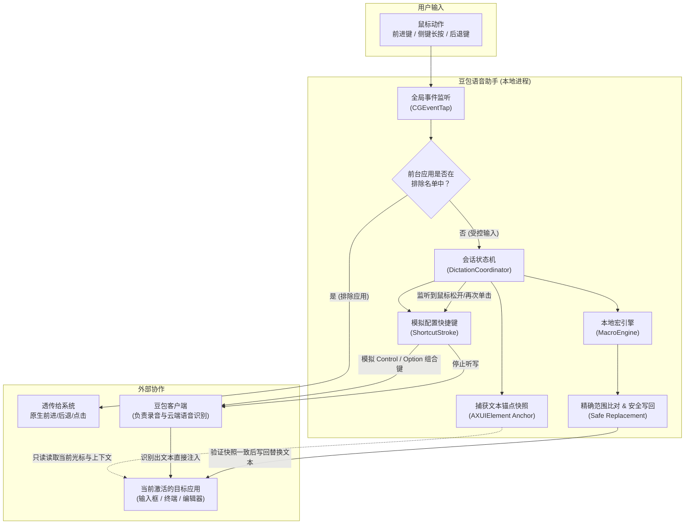

# 豆包语音助手 (Doubao Voice Helper)

<p align="center">
  
</p>

<p align="center">
  <strong>面向 macOS 的本地语音听写增强层 · 鼠标流高频输入加速利器</strong>
</p>

<p align="center">
  <a href="https://github.com/backtomyfuture/doubao-voice-helper/releases"></a>
  <a href="https://developer.apple.com/macos/"></a>
  <a href="https://www.swift.org/"></a>
  <a href="#开发与测试"></a>
  <a href="LICENSE"></a>
  <a href="#安全与隐私原则"></a>
</p>

---

**豆包语音助手 (Doubao Voice Helper)** 是一款专为 macOS 深度用户打造的原生菜单栏工具。它将**豆包输入法**的语音听写能力与鼠标手势深度融合，让你彻底摆脱键盘打断，在单手握持鼠标时即可完成“**切换式听写、按住说话 (PTT)、一键回车发送**”，并在听写结束后通过本地确定性规则引擎自动完成**语音宏替换**（如将口述的“斜杠批准”无感替换为 `/approve`）。

无论是日常聊天、沉浸式文档编写，还是与 AI Agent / 终端命令行高频交互，它都能带来流畅倍增的输入体验。

> 📖 **产品与架构深入文档**：
>
> - 产品需求与设计边界：[`docs/PRODUCT_REQUIREMENTS.md`](docs/PRODUCT_REQUIREMENTS.md)
> - 目标架构与安全选型：[`docs/ARCHITECTURE.md`](docs/ARCHITECTURE.md)
> - 领域模型与核心实体：[`CONTEXT.md`](CONTEXT.md)

---

## 目录

- [为什么需要它？](#为什么需要它)
- [核心特性](#核心特性)
- [工作原理与架构](#工作原理与架构)
- [系统要求](#系统要求)
- [安装与运行](#安装与运行)
  - [方式一：下载 DMG 安装包（推荐）](#方式一下载-dmg-安装包推荐)
  - [方式二：从源码构建（开发者）](#方式二从源码构建开发者)
- [快速上手指南](#快速上手指南)
  - [1. 豆包客户端配置](#1-豆包客户端配置)
  - [2. 系统权限授予](#2-系统权限授予)
  - [3. 罗技鼠标特别适配（Logi Options+ 用户）](#3-罗技鼠标特别适配logi-options-用户)
  - [4. 鼠标按键与快捷键自定义](#4-鼠标按键与快捷键自定义)
  - [5. 配置语音宏（Voice Macro）](#5-配置语音宏voice-macro)
- [安全与隐私原则](#安全与隐私原则)
- [项目结构](#项目结构)
- [开发与测试](#开发与测试)
- [常见问题排查 (FAQ)](#常见问题排查-faq)
- [许可证](#许可证)

---

## 为什么需要它？

虽然豆包输入法已经具备优秀的语音听写识别率，但在高频日常使用与桌面办公中仍然存在操作断层：

1. **双手割裂**：听写必须伸手去按键盘快捷键，打断鼠标工作流；
2. **提交繁琐**：说完一句话后还要把手移回键盘敲回车发送；
3. **符号与命令识别硬伤**：在编程和 AI Agent 交互场景中，口述“斜杠”无法直接转为 `/`，“斜杠批准”无法转为 `/approve`，经常需要手工退格修正；
4. **侧键手势冲突**：许多用户习惯用鼠标侧键在浏览器和访达中翻页，全局改键会破坏原生导航体验。

**豆包语音助手**作为轻量级本地代理层，完美填补了这一体验空白。

---

## 核心特性

- 🖱️ **三组独立鼠标手势映射**
  - **切换式语音 (Toggle)**：默认侧键前进键（Mouse 4）。按一下开始听写，再按一下结束听写。
  - **按住式语音 (Push-to-Talk)**：默认未绑定，可绑定到另一颗侧键或中键。长按超过约 280ms 开启听写，松开即结束；按住前若已选中文字，识别结果会替换选区。**短按会原样回放为一次普通点击**。左键和右键始终保留给系统。
  - **快速提交 (Enter)**：默认侧键后退键（Mouse 3）。单击立即触发 Return 发送，快速完成对话发送或命令行提交。
- ⚡ **确定性本地语音宏引擎 (Macro Engine)**
  - 纯本地执行，无任何云端或 AI 幻觉风险；
  - 遵循**最长匹配优先 (Longest-Match First)** 与**大小写敏感**原则；
  - 匹配时忽略识别结果中的标点和空格（如“斜杠，批准”也能命中“斜杠批准”）；
  - 一条规则可用 `|` 列出多个说法（如 `斜杠|写杠`），兼容同音误识别；
  - 整句都是命令时只输出替换结果，自动去掉豆包补上的结尾标点（“斜杠批准。” ➔ `/approve`）；
  - 内置常用 Agent 命令示例（如“斜杠任务” ➔ `/missions`、“斜杠批准” ➔ `/approve`、“斜杠” ➔ `/`）；
  - 设置面板支持增删改、开关、重复/空规则提示，以及实时预览。
- 🛡️ **安全文本锚点与无损写回 (Safe Replacement)**
  - 在发出豆包快捷键**之前**，通过 macOS Accessibility (`AXUIElement`) 建立**输入会话锚点 (Text Session Anchor)**；
  - 听写结束后等待文本静默 300ms 再判定为最终结果，避开豆包的流式上屏和标点修正；
  - 仅在焦点未变、前后快照边界完全一致的前提下执行局部替换，并读回校验；
  - 对不接受辅助功能写入的应用（多为 Electron 编辑器），只有加入“击键写回”名单、且光标恰好位于本次听写文本之后时，才用退格加模拟输入完成替换；
  - **终端语音宏**：在 Terminal、iTerm2、Ghostty 等终端里比对整屏文本，只有整屏除了光标处这一行的插入外完全没有变化时，才在提示符处用退格加模拟输入完成替换；
  - 其余情况**降级为安全模式 (Trigger Only)**：仅控制豆包启停并保留原始识别结果，绝不乱删、乱覆盖。
- 🎯 **智能应用感知与排除列表**
  - 内置常用浏览器与文件管理器排除名单（Finder, Safari, Google Chrome, Microsoft Edge, Firefox, Arc, Orca, Ego 等）；
  - 切换到排除应用时，侧键自动还原为系统原生前进/后退导航功能（Finder 中自动转换为 `⌘[` / `⌘]`）。
- 🐭 **罗技 Options+ 驱动一键修补 (Logi Patcher)**
  - Logi Options+ 默认会将 MX Master 系列等鼠标的侧键强行转换为系统手势导航，导致第三方软件无法接收原始按键事件；
  - 提供 App 内图形化一键修补以及命令行修复脚本，将侧键还原为标准系统鼠标键。
- 🖥️ **现代 macOS 原生体验**
  - 使用 SwiftUI + AppKit 开发，常驻菜单栏，超低 CPU 与内存占用；
  - 动态状态图标（空闲线框鼠标 / 监听中实心鼠标切换）；
  - 可选的轻量屏幕状态浮层 (Overlay)，听写状态一目了然；
  - 基于现代 `SMAppService` 的开机自启机制。
- 🔄 **自动更新支持**：内置 GitHub Releases 版本检测与一键更新；安装前校验更新包签名必须与当前应用一致，且版本更高。

---

## 工作原理与架构



---

## 系统要求

- **操作系统**：macOS 14.0 (Sonoma) 或更高版本
- **硬件架构**：Apple Silicon (M1/M2/M3/M4 系列芯片) 或 Intel Mac
- **先决软件**：已安装并运行「豆包」官方桌面客户端
- **系统权限**：
  - 必须授予 **辅助功能 (Accessibility)** 权限（用于捕获文本焦点锚点及安全写回）
  - 若使用除左/右/中键以外的额外鼠标侧键，需授予 **输入监控 (Input Monitoring)** 权限

---

## 安装与运行

### 方式一：下载 DMG 安装包（推荐）

1. 前往项目的 [GitHub Releases 页面](https://github.com/backtomyfuture/doubao-voice-helper/releases)；
2. 下载最新发布的 `DoubaoVoiceHelper.dmg`；
3. 双击打开镜像，将 `DoubaoVoiceHelper.app` 拖拽至 `Applications`（应用程序）文件夹；
4. 双击打开应用，并根据引导完成权限授予。

### 方式二：从源码构建（开发者）

本地构建需要 Xcode 16 或同等版本的 Command Line Tools（Swift 6.0+，项目使用 Swift 6 语言模式）：

```bash
# 1. 克隆代码仓库
git clone https://github.com/backtomyfuture/doubao-voice-helper.git
cd doubao-voice-helper

# 2. 运行核心单元测试
swift run DoubaoVoiceHelperCoreTests

# 3. 创建本机稳定的代码签名证书（关键步骤，见后文说明）
./scripts/setup_local_signing.sh

# 4. 构建并打包生成 DoubaoVoiceHelper.app
./scripts/build_app.sh

# 5. (可选) 打包生成 DMG 安装镜像
./scripts/build_dmg.sh
```

> [!TIP]
> **为什么必须运行 `setup_local_signing.sh`？**
> macOS 的辅助功能授权基于二进制代码签名哈希绑定。如果采用默认 Ad-hoc 签名（`-`），每次代码修改后重新编译都会导致签名哈希改变，进而迫使系统反复要求用户在“系统设置”中重新勾选辅助功能授权。
> 运行 `./scripts/setup_local_signing.sh` 会在 macOS 本地登录钥匙串中创建并信任名为 `DoubaoVoiceHelper Development` 的稳定自签名证书，免去日常开发调试反复授权的困扰。

---

## 快速上手指南

### 1. 豆包客户端配置

1. 打开豆包桌面客户端，进入「设置」；
2. 找到「语音输入快捷键」设置项：
   - 建议设置为默认的 `左 Control`（用于切换式听写）或自定义组合键；
3. 确保豆包的后台运行与语音功能正常可用。

### 2. 系统权限授予

首次启动应用时，豆包语音助手会弹出权限向导：

1. 打开 **系统设置** ➔ **隐私与安全性** ➔ **辅助功能**；
2. 将 **豆包语音助手 (DoubaoVoiceHelper)** 勾选为允许；
3. 若使用了前进/后退等扩展侧键，在 **输入监控** 中同样勾选允许；
4. 在应用菜单栏图标中点击“检查权限”进行校验确认。

> [!NOTE]
> 豆包语音助手**不需要麦克风权限**。所有的录音和音频处理均由豆包官方客户端自行完成。

### 3. 罗技鼠标特别适配（Logi Options+ 用户）

如果你使用的是罗技鼠标（如 MX Master 3 / 3S / Anywhere 等）并安装了 Logi Options+：
- Logi Options+ 会在底层拦截侧键并转译为 macOS 手势导航，导致所有全局监听软件都无法收到按键。
- **解决方案**：
  - **在 App 设置中**：直接点击“一键修补 Logi Options+ 侧键”按钮；
  - **在终端中**：运行 `./scripts/patch_logi_buttons.py`。
  - 该脚本会自动备份你的配置数据库，并将前进/后退侧键恢复为标准系统鼠标键（Button 4 / Button 3）。

### 4. 鼠标按键与快捷键自定义

在菜单栏点击鼠标图标，选择 **打开设置…**：

| 映射动作 | 默认鼠标按键 | 默认模拟快捷键 | 说明 |
|---|---|---|---|
| **切换式语音 (Toggle)** | 前进键 (`Button 4`) | `左 Control` | 按一下开始，再按一下结束 |
| **按住式语音 (Hold)** | 未绑定（可绑定侧键或中键） | `左 Control + Option` | 长按说话，松开结束，短按回放为普通点击 |
| **快速提交 (Enter)** | 后退键 (`Button 3`) | `Return` | 按下单发回车 |

> [!TIP]
> 支持在设置窗口中点击“录制按键”，直接按下鼠标对应按键即可完成捕获。

### 5. 配置语音宏（Voice Macro）

语音宏负责在听写完成的一瞬间，将特定口述字串替换为你期望的文本。

在设置界面的 **语音宏** 区域，你可以添加、删除或切换规则：

| 来源文本 (Source) | 替换为 (Replacement) | 典型应用场景 |
|---|---|---|
| `斜杠批准` | `/approve` | 快速批准 AI Agent 任务 |
| `斜杠任务` | `/missions` | 查看当前工作流任务清单 |
| `斜杠` | `/` | 快速输入各种命令前缀 |
| `波浪号` | `~` | 命令行家目录或路径 |
| `叹号` | `!` | 标点符号与特殊字符 |
| `斜杠\|写杠\|鞋杠` | `/` | 用 `\|` 兼容同音误识别 |

> [!TIP]
> 设置页底部的预览框可以直接输入一段文本，查看规则的替换结果。

---

## 安全与隐私原则

1. **零音频访问 (Zero Audio Access)**：本软件不申请麦克风权限，不读取音频流，也不内置任何网络音频上传逻辑。
2. **数据驻留本机 (Local First)**：所有用户配置、按键映射、排除名单和语音宏规则均以 JSON 格式存储在本地 `~/Library/Application Support/DoubaoVoiceHelper/`，不进行任何云端数据收集。
3. **最小化系统监听**：通过 `CGEventTap` 仅拦截用户配置的具体鼠标键。键盘监听只在听写进行中开启，且只识别 Esc，**不记录任何键盘输入**。
4. **安全写回与失败降级**：严格通过 macOS Accessibility 验证编辑框状态。遇到不匹配或非标准控件，仅触发豆包启停，保留原始文本，坚决不进行破坏性覆写。
5. **日志不含内容**：统一日志只记录应用标识、文本长度、命中数量和耗时，**不记录听写原文或替换结果**。

---

## 项目结构

```text
.
├── Package.swift                       # Swift Package 清单 (Core、App 与测试目标)
├── Sources
│   ├── DoubaoVoiceHelperCore/          # 核心业务逻辑库 (独立可测)
│   │   ├── Models.swift                # 数据结构 (快捷键、鼠标映射、设置与宏规则)
│   │   ├── MacroEngine.swift           # 确定性语音宏替换引擎 (最长匹配、别名、标点忽略)
│   │   ├── SessionPolicy.swift         # 会话触发策略与文本稳定等待策略 (纯函数)
│   │   ├── TextInsertionDiff.swift     # 锚点前后快照比对，推断本次新增文本 (纯函数)
│   │   ├── TerminalInsertionDiff.swift # 终端整屏文本比对，推断提示符处的插入 (纯函数)
│   │   ├── TextTargets.swift           # 辅助功能 (AX) 锚点、稳定检测与写回
│   │   ├── HoldPolicy.swift            # 鼠标长按阈值、拖动取消与命中探测
│   │   ├── SelectionRestore.swift      # 按住式听写的选区恢复
│   │   ├── ShortcutStroke.swift        # 键盘组合键合成与事件模拟
│   │   ├── SystemServices.swift        # 权限、快捷键发送、登录启动
│   │   ├── LogiOptionsPatcher.swift    # Logi Options+ 数据库配置修补
│   │   └── SettingsRepository.swift    # 本地配置存储与版本迁移
│   └── DoubaoVoiceHelper/              # 原生 macOS 桌面 App
│       ├── App.swift                   # SwiftUI App 入口与 MenuBarExtra
│       ├── AppModel.swift              # 界面状态、设置、权限与首启引导
│       ├── DictationCoordinator.swift  # 听写会话协调 (触发、快捷键、锚点、语音宏写回)
│       ├── Diagnostics.swift           # 只含元数据的统一日志
│       ├── Views.swift                 # 状态菜单与设置面板
│       ├── OnboardingView.swift        # 首启引导
│       ├── MouseEventMonitor.swift     # 全局鼠标 CGEventTap 监听器
│       ├── OverlayController.swift     # 屏幕轻量状态浮层 HUD
│       ├── UpdateService.swift         # GitHub Releases 更新检查与安装
│       └── UpdateVerifier.swift        # 更新包签名与版本校验
├── Tests
│   └── DoubaoVoiceHelperCoreTests/     # 核心功能单元测试 (51 个用例)
├── Resources/                          # 应用图标、状态栏线框图标、DMG 背景图、Info.plist
├── docs/                               # 产品需求文档 (PRD) 与技术架构文档
├── archive/                            # 早期原型代码与原始图标素材 (不参与构建)
└── scripts/                            # 本机开发签名、打包 App、生成 DMG 与罗技按键修复脚本
```

---

## 开发与测试

### 编译与运行测试

```bash
# 编译 Debug 版本
swift build

# 运行全套单元测试
swift run DoubaoVoiceHelperCoreTests
```

### 构建与打包

```bash
# 构建已签名的 Release 应用程序包 (输出至 build/DoubaoVoiceHelper.app)
./scripts/build_app.sh

# 生成 DMG 安装文件 (输出至 build/DoubaoVoiceHelper.dmg)
./scripts/build_dmg.sh
```

如需使用指定的 Apple 开发者签名证书进行构建，可设置环境变量：

```bash
CODESIGN_IDENTITY="Developer ID Application: Your Name (TEAMID)" ./scripts/build_app.sh
```

---

## 常见问题排查 (FAQ)

<details>
<summary><strong>Q: 为什么按下鼠标侧键没有任何反应？</strong></summary>

1. **检查系统权限**：进入“系统设置 ➔ 隐私与安全性”，确认 **辅助功能** 和 **输入监控** 中均已允许 `DoubaoVoiceHelper`；
2. **罗技鼠标用户**：如果您安装了 Logi Options+，该软件会拦截前进后退侧键。请点击设置界面的“修补 Logi Options+ 侧键”按钮或执行 `./scripts/patch_logi_buttons.py` 还原为标准鼠标键。
</details>

<details>
<summary><strong>Q: 重新编译代码后，为什么辅助功能权限失效或反复提示授权？</strong></summary>

macOS 的辅助功能权限是绑定到代码签名身份的。每次编译若产生新的临时签名，系统会将其视作全新应用而吊销权限。请先运行一次 `./scripts/setup_local_signing.sh` 生成本机长期稳定的签名身份，之后脚本编译就会复用该身份。
</details>

<details>
<summary><strong>Q: 为什么在 Chrome、Safari 或访达里侧键依然是翻页/后退？</strong></summary>

这是符合预期的功能。为了不影响正常的网页与文件浏览体验，浏览器和文件管理器默认加入在应用的**排除列表**中。如需在这些应用中使用语音功能，可在“设置 ➔ 排除应用”中将其移除。
</details>

<details>
<summary><strong>Q: 终端里的语音宏是怎么工作的？为什么有时没有生效？</strong></summary>

终端的辅助功能文本是只读的整屏缓冲区。“设置 ➔ 终端语音宏”名单内的终端（默认包括 Terminal、iTerm2、Ghostty、WezTerm、kitty、Warp）会在听写前后比对整屏文本，满足以下条件才替换：

- 除光标处这一行的插入外，整屏没有任何变化（没有命令输出、时钟刷新等）；
- 插入内容不跨行（长句自动换行时不处理）；
- 插入只占用了原本的空白（例如 TUI 输入框的填充空格），没有覆盖占位提示文字。

满足时，应用在提示符处退格删除本次听写，再输入替换结果（期间临时切换到英文键盘布局），并确认提示符前的内容紧接着替换结果。任一条件不满足，或终端没有开放辅助功能文本，都会进入**安全降级模式 (Trigger Only)**，保留原文。

如果某个 TUI 在输入框为空时显示占位提示文字，听写会覆盖这段文字，此时不会替换；输入框已有内容时可以正常替换。
</details>

<details>
<summary><strong>Q: 为什么在某个编辑器里提示“此应用不接受写回，已保留原文”？</strong></summary>

该应用接受了辅助功能写入请求，但文本没有真正改变（Electron / Chromium 类应用常见）。可以在“设置 ➔ 击键写回（语音宏）”中加入该应用。加入后，只有在光标恰好位于本次听写文本之后时，才会用退格加模拟输入完成替换；替换期间会临时切换到英文键盘布局，避免中文输入法拦截。
</details>

<details>
<summary><strong>Q: 一键更新提示“签名校验失败”或“临时签名，无法校验”？</strong></summary>

一键更新只安装与当前应用签名身份一致、且版本更高的更新包。如果你运行的是临时签名（ad-hoc）构建，或者发布签名从自签名证书换成了 Developer ID，需要前往 GitHub Releases 手动下载安装一次。
</details>

<details>
<summary><strong>Q: 本工具是否支持仅用纯按住（Push to Talk）或者仅用切换（Toggle）？</strong></summary>

支持。在设置中，三组映射（切换式、按住式、回车）相互独立。你可以将不希望使用的动作绑定设置为无，或者按需绑定到不同的鼠标按键上。
</details>

---

## 许可证

本项目基于 [MIT License](LICENSE) 开源。欢迎提交 Issue 与 Pull Request！
