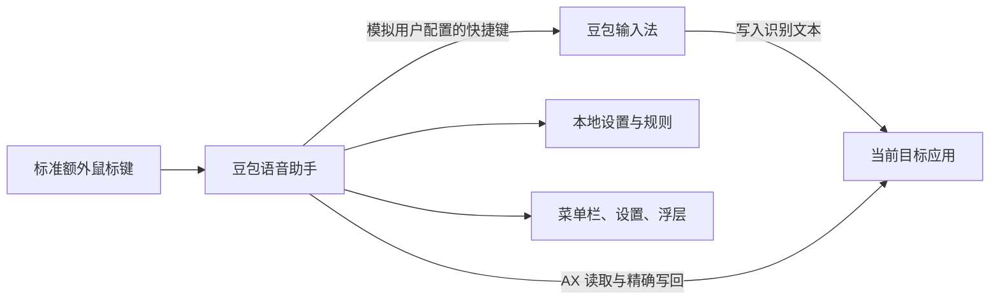
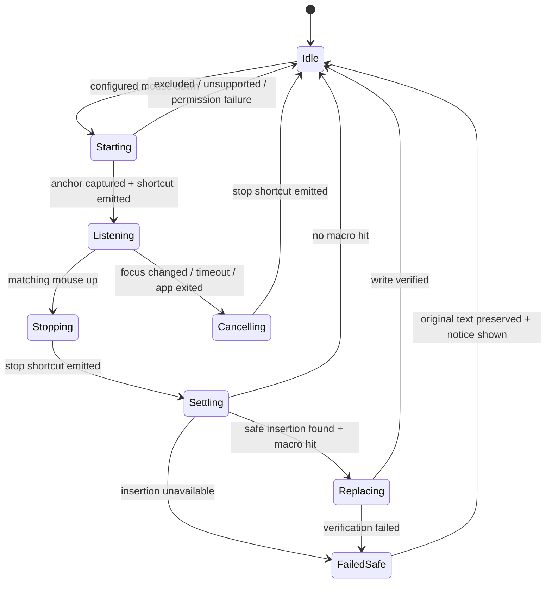

# 豆包语音助手：目标架构

## 1. 架构目标

将当前单文件后台原型重建为可配置、可诊断、可分发的原生 macOS App，同时保持以下边界：

- 豆包负责录音和语音识别。
- 本 App 负责鼠标触发、会话编排和确定性文本替换。
- 所有数据留在本机。
- 任何文本操作都必须先证明目标和范围安全。

## 2. 当前原型评估

当前 `src/doubao_mouse_ptt.swift` 已验证：

- `CGEventTap` 可以监听指定额外鼠标键。
- 可用模拟快捷键控制豆包开始和结束。
- 可根据前台应用 bundle ID 透传鼠标行为。
- Accessibility 授权可支撑当前事件监听。

原型不应直接扩展为正式产品，原因包括：

- 配置和日志固定在 `~/.hermes`。
- LaunchAgent 和 plist 包含个人绝对路径。
- 没有设置界面、权限状态或异常恢复体验。
- 快捷键只表示单个 key code，不能完整表达组合键。
- `talking` 是本地推测状态，无法确认豆包真实状态。
- 没有文本会话边界，因此无法安全实现语音宏。
- 历史脚本会直接修改 Logi Options+ 私有数据库。
- 仓库包含预编译二进制和手工组装的 App，不利于可重复构建。

结论：保留原型作为行为参考，正式版本建立新的 Xcode 工程和模块边界。

## 3. 技术选型

| 领域 | 选择 | 原因 |
|---|---|---|
| 语言 | Swift | 原生系统 API、类型安全、便于签名分发 |
| UI | SwiftUI + 必要的 AppKit | 设置界面简单，事件、浮层和 AX 能力仍需 AppKit |
| App 形态 | `MenuBarExtra` + Settings window | 常驻但不占 Dock，状态和配置入口明确 |
| 全局输入 | CoreGraphics `CGEventTap` | 原型已验证，支持标准额外鼠标键 |
| 辅助功能 | `AXUIElement` | 获取焦点控件、文本与选择范围 |
| 登录启动 | `SMAppService` | 使用系统登录项，不写 LaunchAgent |
| 配置 | Codable JSON，Application Support | 可迁移、可版本化，为后续导入导出预留 |
| 日志 | `os.Logger` | 支持隐私标记，不维护包含用户内容的日志文件 |
| 并发 | Swift Concurrency actor | 串行化会话状态，减少按下/释放竞态 |
| 依赖 | 首版不引入第三方运行时依赖 | 减少权限型 App 的供应链和分发复杂度 |

MVP 采用非沙盒直接分发。公开分发时增加 Developer ID、Hardened Runtime 和公证。

## 4. 系统上下文



本 App 不接收音频，也不与豆包网络服务通信。

## 5. 模块划分

```text
DoubaoVoiceHelperApp
├── AppShell
│   ├── MenuBarController
│   ├── SettingsWindow
│   ├── OnboardingFlow
│   └── StatusOverlay
├── Input
│   ├── MouseEventMonitor
│   ├── MouseBindingCapture
│   └── ShortcutEmitter
├── Session
│   ├── DictationCoordinator
│   ├── DictationState
│   └── FocusIdentity
├── TextTargets
│   ├── TextTargetResolver
│   ├── TextTargetAdapter
│   ├── AXTextAdapter
│   └── AppSpecificAdapters
├── Macros
│   ├── MacroEngine
│   ├── MacroRule
│   └── MacroValidator
├── Persistence
│   ├── SettingsRepository
│   └── SettingsMigration
└── System
    ├── PermissionService
    ├── LoginItemService
    ├── Diagnostics
    └── Clock
```

### 5.1 深层接口

鼠标监听、豆包控制和文本适配必须通过小而稳定的接口隔离系统 API：

```swift
protocol MouseEventMonitoring {
    func start(handler: @escaping @Sendable (MouseButtonEvent) -> EventDisposition) throws
    func stop()
}

protocol ShortcutEmitting {
    func emit(_ shortcut: KeyboardShortcut) throws
}

protocol TextTargetAdapter {
    func beginSession() async throws -> TextSessionAnchor
    func waitForInsertedText(
        after anchor: TextSessionAnchor,
        timeout: Duration
    ) async throws -> InsertedText
    func replace(_ insertion: InsertedText, with text: String) async throws
}
```

`TextTargetAdapter` 是最关键的架构缝隙。上层协调器不关心 Terminal、Ghostty 或 Electron 如何暴露文本，只接受“已验证的文本范围”或明确失败。

## 6. 会话状态机



状态由单个 `DictationCoordinator` actor 持有。任何时间只允许一个活跃会话。

### 6.1 必须处理的异常

- 重复 mouse-down。
- mouse-up 丢失。
- App 被系统停用 event tap。
- 权限撤销。
- 系统睡眠或锁屏。
- 目标进程退出。
- 前台应用、窗口或焦点元素变化。
- 豆包没有产生文本。
- 用户在听写期间主动输入。

发生不确定情况时回到 `Idle`，不执行替换。

## 7. 输入事件设计

### 7.1 鼠标监听

- 事件 mask 包含 `leftMouseDown`/`leftMouseUp`、`rightMouseDown`/`rightMouseUp` 和 `otherMouseDown`/`otherMouseUp`。
- 未绑定按键始终透传。
- 绑定按键在排除应用中始终透传。
- 额外鼠标键在有效目标中被消费，避免同时触发浏览器前进/后退。
- 左键和右键始终透传；只有按住超过短按阈值才触发听写，因此普通点击不改变原有行为。
- 按键捕获模式显示收到的 button number，由用户确认绑定。
- 不依赖 Logitech、Razer 或其他厂商 SDK。

若厂商软件不发送标准额外鼠标事件，产品只提供配置指南，不修改其数据库。

### 7.2 豆包快捷键

`KeyboardShortcut` 必须包含：

- 主键。
- Command、Option、Control、Shift 修饰键集合。
- 左右修饰键差异仅在系统 API 可稳定表达时保留。

发出快捷键后立即释放所有模拟按键。进程终止或取消任务时也执行防御性释放。

本 App 只能维护“预期豆包状态”，不能把它当作豆包真实状态。设置页应提供独立测试操作。

## 8. 文本会话与目标适配

### 8.1 安全锚点

按下鼠标时记录：

- 目标进程 PID 和 bundle ID。
- 窗口身份。
- 焦点 AX 元素身份与 role。
- 选择范围和可用的局部文本快照。
- 单调时钟时间。

松开后再次验证上述身份。任一身份变化都会取消替换。

### 8.2 文本稳定检测

停止豆包后，适配器以短间隔观察目标文本：

1. 文本发生变化后开始稳定计时。
2. 连续两个或多个采样窗口内容不再变化，视为稳定。
3. 达到总超时仍不稳定则失败。
4. 只返回能够从前后快照中唯一证明的新增范围。

采样参数属于可测试配置，不暴露为普通用户设置。

### 8.3 适配器层级

1. **AXTextAdapter**：处理标准可编辑文本控件，使用值与选择范围计算插入区域。
2. **Terminal.app adapter**：仅在实测 AX 属性可证明范围后实现。
3. **Ghostty adapter**：根据其实际 AX 树与输入控件行为实现。
4. **Electron terminal adapter**：面向 Cursor/VS Code 内嵌终端单独验证。

不能只根据 bundle ID 宣称支持。每个适配器需要能力探测，并返回：

- `supported`
- `triggerOnly`
- `temporarilyUnavailable`
- `unsafe`

`triggerOnly` 表示鼠标控制豆包可用，但语音宏不执行。

### 8.4 禁止的通用回退

MVP 不允许：

- 猜测新增字符数后发送退格。
- 自动执行 Undo。
- 选中整行后重写。
- 未经用户知情地覆盖剪贴板。
- 向新焦点控件粘贴旧会话文本。

这些方式可能破坏终端命令、编辑器历史或敏感剪贴板内容。

## 9. 语音宏引擎

```swift
struct MacroRule: Codable, Identifiable, Sendable {
    let id: UUID
    var source: String
    var replacement: String
    var isEnabled: Bool
}
```

处理算法：

1. 过滤禁用规则。
2. 验证源文本非空且不重复。
3. 按源文本 Unicode 长度降序排列，同长度保持用户顺序。
4. 从左到右扫描本次新增文本。
5. 同一位置选择第一条匹配规则。
6. 将替换结果直接写入输出，不再参与后续规则匹配。

该算法结果确定、无循环，并能保证“斜杠批准”优先于“斜杠”。

规则引擎是纯函数模块，应与 Accessibility、UI 和持久化完全解耦。

## 10. 设置与数据

建议目录：

```text
~/Library/Application Support/<bundle-id>/
└── settings.json
```

建议顶层结构：

```json
{
  "schemaVersion": 1,
  "mouseBinding": { "button": 4 },
  "doubaoShortcut": { "keyCode": 59, "modifiers": ["control"] },
  "excludedBundleIds": [],
  "macroRules": [],
  "launchAtLogin": true,
  "overlayEnabled": true
}
```

要求：

- 原子写入，先写临时文件再替换。
- schema 版本显式存在。
- 未知字段可忽略，缺失字段使用安全默认值。
- 损坏配置先备份，再创建默认配置。
- 首版不提供导入导出，但内部格式从第一天起可迁移。

## 11. UI 架构

### 菜单栏

- 当前状态：就绪、听写中、暂停、缺少权限、发生错误。
- 暂停/恢复。
- 打开设置。
- 权限检查。
- 退出。

### 设置窗口

- 常规：登录启动、浮层开关。
- 输入：鼠标按键捕获、豆包快捷键录入和测试。
- 应用：排除列表、当前前台应用快速添加。
- 语音宏：增删改、启停、排序和预览测试。
- 诊断：权限状态、版本、兼容状态、导出不含内容的诊断信息。

### 浮层

- 不抢键盘焦点。
- 在多显示器和全屏 Space 中只显示于当前活动屏幕。
- 显示“正在听写”“正在处理”“未应用语音宏”等短状态。
- 错误自动消失，详细信息进入设置页。

## 12. 权限模型

预期需要：

- **辅助功能**：模拟豆包快捷键，读取和修改支持的焦点文本控件。
- **输入监控**：系统版本和事件 tap 类型要求时，用于监听全局鼠标事件。

明确不需要：

- 麦克风。
- 屏幕录制。
- 通讯录、文件夹或网络权限。

权限服务必须区分“未请求”“已拒绝”“已授权”“需重启 App”，并提供跳转系统设置的入口。

## 13. 登录启动与进程模型

- App 本身常驻菜单栏，不再维护独立 daemon。
- 使用 `SMAppService.mainApp` 管理登录启动。
- 首启询问是否开启，界面默认选中。
- 用户拒绝后仍可在设置中随时开启。
- 不生成 plist，不硬编码安装路径。

单进程模型足以满足 MVP。只有在未来证明 UI 重启会影响事件可靠性时，才评估 helper process。

## 14. 诊断与隐私

使用统一日志并采用稳定事件名，例如：

- `mouse_session_started`
- `shortcut_emitted`
- `focus_changed`
- `text_settle_timeout`
- `adapter_unsupported`
- `macro_applied`
- `replacement_verified`

允许记录：

- App bundle ID。
- 适配器名称。
- 状态变化。
- 延迟、文本长度和命中规则数量。
- 错误码。

禁止记录：

- 听写文本。
- 替换后的文本。
- 规则源文本或目标文本。
- 完整 AX 控件内容。
- 剪贴板内容。

## 15. 构建与分发

### MVP

- 新建标准 Xcode 工程，可重复构建 `.app`。
- Deployment Target 为 macOS 14。
- 架构仅 `arm64`。
- 使用稳定、非个人化的 bundle identifier。
- 生成 ad hoc 或本地开发签名测试包。
- 通过压缩包或磁盘映像手工分发。
- 提供 Gatekeeper 打开说明和卸载说明。

### 公开分发

- Developer ID Application 签名。
- Hardened Runtime。
- Apple 公证与 stapling。
- 可验证的自动更新签名。
- 隐私说明、兼容列表和非官方产品声明。

MVP 不以 Mac App Store 为目标。

## 16. 测试策略

### 单元测试

- 语音宏最长匹配、非递归和 Unicode 行为。
- 设置迁移和损坏恢复。
- 排除列表匹配。
- 会话状态机的重复事件、超时和取消。

### 组件测试

- 使用假的时钟、鼠标监视器、快捷键发送器和文本适配器测试协调器。
- 验证失败路径从不调用 `replace`。
- 验证任何焦点身份变化都会取消会话。

### 手工集成矩阵

每个 macOS 版本和目标应用记录：

- 鼠标 down/up 是否完整。
- 豆包快捷键是否可靠。
- 焦点身份是否稳定。
- 新增文本范围是否可证明。
- 替换和光标恢复是否正确。
- 不支持时是否安全降级。

最低矩阵：

| 环境 | 鼠标触发 | 语音宏 | 焦点切换 | 排除透传 |
|---|---:|---:|---:|---:|
| Terminal.app | 必测 | 必测 | 必测 | 必测 |
| Ghostty | 必测 | 必测 | 必测 | 必测 |
| Cursor/VS Code 内嵌终端 | 必测 | 必测 | 必测 | 必测 |

## 17. 建议实施顺序

1. 建立 Xcode App 壳、菜单栏和设置持久化。
2. 移植鼠标监听和可配置快捷键，先保持无文本处理。
3. 实现会话状态机、权限服务和安全取消。
4. 开发 AX 探针，完成三个验收应用的前置验证。
5. 固化 `TextTargetAdapter` 接口，实现通过验证的适配器。
6. 实现纯函数语音宏引擎。
7. 接入稳定检测、精确替换和写回验证。
8. 完成浮层、登录启动、诊断和兼容矩阵。
9. 打包熟人测试版本，执行完整验收。

在第 4 步完成前，不应承诺三个验收应用都支持语音宏。

## 18. 架构决策摘要

| 决策 | 选择 |
|---|---|
| 与豆包关系 | 非侵入式增强层 |
| UI 形态 | 菜单栏 + 设置窗口 |
| 平台 | macOS 14+，Apple Silicon |
| 鼠标 | 标准额外鼠标键 |
| 交互 | 按住说话，松开结束 |
| 文本规则 | 本次听写内的确定性字面替换 |
| 安全策略 | 无法证明范围则保留原文 |
| 数据 | 完全本地、可迁移 JSON |
| 登录启动 | `SMAppService`，首启默认开启 |
| 分发 | 首版未公证测试包，手工更新 |
| 自动回车 | 第二阶段，按应用开关且默认关闭 |
