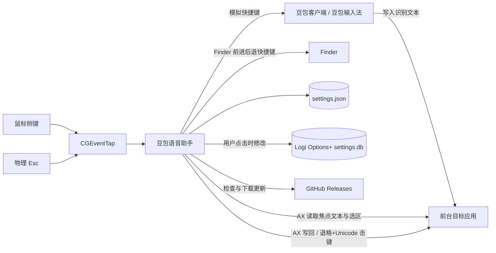
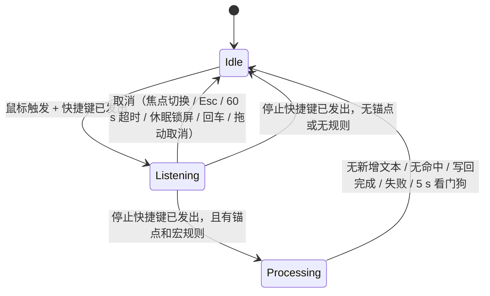

# 豆包语音助手：架构说明

## 0. 文档说明

- **基线版本**：v0.1.8（`81f811d`），并包含工作区中宏引擎标点归一化、分段采样间隔等未提交改动。
- **定位**：本文描述代码的**实际架构**，而不是理想设计。初版文档中的规划性内容已按现状修订；仍然有效的设计原则保留在第 2 节。
- **标记约定**：
  - 【偏差】实现与第 2 节原则不一致，需要决策是修改代码还是修改原则。
  - 【遗留】代码存在但当前配置下不会执行，或属于原型时期的资产。
  - 【待定】尚未定论的设计问题。
- 第 19 节汇总所有偏差与待定项，是后续迭代的决策清单。

## 1. 产品边界

豆包语音助手是 macOS 菜单栏常驻的本地增强层：

- **豆包负责**：录音、语音识别、把识别结果写入当前焦点控件。
- **本 App 负责**：把鼠标按键翻译成豆包快捷键、编排一次听写会话、在听写结束后对本次新增文本执行语音宏替换。
- **本 App 不做**：录音、访问麦克风、调用任何语音或 AI 服务、与豆包进程通信。

本 App 只能维护“预期的豆包状态”。豆包是否真的开始或停止录音，本 App 无法观测。

## 2. 设计原则

| 原则 | 含义 | 当前遵守情况 |
|---|---|---|
| 增强而非替代 | 只控制豆包并后处理其输出 | 遵守 |
| 本地优先 | 设置与规则仅存于本机，不上传 | 遵守（仅更新检查访问 GitHub） |
| 可证明才替换 | 无法证明本次新增文本范围时保留原文 | 【偏差】见 §10.3、§10.4 |
| 最小监听 | 只拦截已绑定的鼠标键 | 【偏差】事件监听常驻订阅键盘按下，见 §7.1 |
| 日志不含内容 | 日志不记录听写文本、替换结果 | 【偏差】见 §17 |
| 失败可恢复 | 任何异常都回到空闲，不遗留按下的模拟按键 | 基本遵守，有超时兜底 |
| 明确反馈 | 开始、停止、失败有可见状态 | 遵守（菜单栏图标 + 浮层） |

## 3. 技术栈

| 领域 | 实际选择 | 说明 |
|---|---|---|
| 构建 | Swift Package Manager（tools 5.9） | 没有 Xcode 工程；`scripts/build_app.sh` 手工组装 `.app` |
| 语言模式 | Swift 5，未开启严格并发检查 | 大量使用 `@unchecked Sendable` + `NSLock` |
| UI | SwiftUI（`MenuBarExtra`、`Form`）+ AppKit（`NSWindow`、`NSPanel`、`NSOpenPanel`） | |
| 全局输入 | `CGEventTap`（`.cghidEventTap`、`.headInsertEventTap`、`.defaultTap`） | 专用线程运行 RunLoop |
| 模拟按键 | `CGEvent` 键盘事件，`hidSystemState` 事件源 | 投递到 `.cghidEventTap` |
| 文本读写 | Accessibility `AXUIElement` | 同步 API，在后台队列调用 |
| 并发 | GCD（主队列 + 全局队列 + 若干串行队列）+ 锁 | 未使用 actor |
| 持久化 | Codable JSON，Application Support | |
| 日志 | `os.Logger`，subsystem `com.jarod.doubao-voice-helper` | |
| 登录启动 | `SMAppService.mainApp` | |
| 第三方依赖 | 无运行时依赖；Logi 修补使用系统 `SQLite3` | |
| 平台 | macOS 14+，Apple Silicon 与 Intel 均可构建 | |

## 4. 系统上下文



## 5. 代码结构

```text
Sources/
├── DoubaoVoiceHelperCore/            # 可单测的库，不依赖 SwiftUI
│   ├── Models.swift                  # KeyboardShortcut、MouseBinding、MacroRule、AppSettings（含迁移）、AppVersion
│   ├── MacroEngine.swift             # 语音宏纯函数引擎
│   ├── ShortcutStroke.swift          # 快捷键 → 按键事件序列与 flag 位（纯函数）
│   ├── SystemServices.swift          # PermissionService、CoreGraphicsShortcutEmitter、LoginItemService
│   ├── TextTargets.swift             # AXTextAdapter：锚点、稳定检测、新增文本推断、写回
│   ├── SelectionRestore.swift        # 按住式听写时恢复用户原选区
│   ├── HoldPolicy.swift              # 长按阈值、拖动取消、AX 命中探测、排除列表匹配、微信区域
│   ├── SettingsRepository.swift      # settings.json 读写与损坏备份
│   └── LogiOptionsPatcher.swift      # Logi Options+ 侧键修补
└── DoubaoVoiceHelper/                # App 目标
    ├── App.swift                     # @main、MenuBarExtra
    ├── AppModel.swift                # 全局状态 + 会话协调（约 1270 行）
    ├── MouseEventMonitor.swift       # 事件监听、按住判定、点击回放（约 1070 行）
    ├── Views.swift                   # 菜单栏菜单、设置表单、快捷键录制器
    ├── OnboardingView.swift          # 首启引导
    ├── SettingsWindowController.swift
    ├── OverlayController.swift       # 屏幕浮层
    ├── UpdateService.swift           # GitHub 更新
    └── BrandIconView.swift
Tests/DoubaoVoiceHelperCoreTests/main.swift   # 自定义可执行测试运行器
```

`AppModel` 同时承担 UI 状态、设置编辑、权限、引导流程和会话状态机；`MouseEventMonitor` 同时承担事件分派、按住判定、左键抢占与合成事件回放。两者是当前最主要的复杂度集中点。

## 6. 线程模型

| 执行上下文 | 负责内容 |
|---|---|
| 主线程（`@MainActor`） | `AppModel` 全部状态、会话开始/结束、**模拟快捷键发送**、浮层、设置保存 |
| 事件监听线程 `…mouse-events` | `CGEventTap` 回调：读取配置、判断角色与排除、决定吞掉或透传 |
| `…hold-probe` 串行队列 | 按住判定时的 AX 命中测试（`AXUIElementCopyElementAtPosition` + 祖先 role） |
| 全局 `userInteractive` 队列 | 长按阈值定时器、物理按键轮询与移动轮询（60 Hz，仅按住判定期间） |
| 全局 `userInitiated` 队列 | 锚点捕获、稳定检测、宏替换写回、Logi 修补 |
| `…navigation` 串行队列 | Finder 前进/后退快捷键合成 |

事件监听回调通过 `DispatchQueue.main.async` 把 `MouseButtonEvent` 交给 `AppModel.handle`。`MouseEventMonitor` 的内部状态由单个 `NSLock` 保护；`ActiveSession.anchor` 有独立锁，其余可变字段（`phase`、`bundleIdentifier` 等）只在主线程读写。

## 7. 输入事件处理

### 7.1 事件监听

- 订阅类型：`otherMouseDown`、`otherMouseUp`、`otherMouseDragged`、`keyDown`。
- `keyDown` **常驻订阅**，但只在会话进行中（`swallowEscape == true`）处理 Esc，且 Esc 始终透传。【偏差】与“最小监听”不符，所有键盘按下都会经过回调。
- 本 App 合成的事件在 `eventSourceUserData` 中带有标记 `0x4442484C5054`，回调直接透传，避免回环。
- 收到 `tapDisabledByTimeout` / `tapDisabledByUserInput` 时立即重新启用。
- 每个鼠标事件在回调中调用 `NSWorkspace.shared.frontmostApplication` 获取前台应用。

### 7.2 角色分派

- 只处理 `button > 1` 的按键；左键、右键始终透传。设置层同样拒绝绑定 0/1。
- 角色优先级：按住式 > 切换式 > 回车。未绑定按键上报 `.unbound`（仅用于诊断）后透传。
- **捕获模式**：下一次额外键按下上报 `.capture`，用于设置页绑定和首启确认。
- 暂停或首启未完成时全部透传。
- 已绑定的额外键在非排除应用中被**吞掉**，不会触发浏览器前进/后退。

### 7.3 排除应用

- 两份列表：`excludedBundleIDs`（作用于切换式和回车）与 `holdExcludedBundleIDs`（作用于按住式）。匹配规则为完全相等或以 `<id>.` 为前缀。
- 默认排除常见浏览器、Finder、Preview、Orca、Ego 以及本 App 自身；每次加载设置都会补回本 App 的 bundle ID。
- 在排除应用中按键原样透传。**例外**：Finder 中的侧键被吞掉，改为合成 `⌘[` / `⌘]`，因为 Finder 不响应原生侧键导航。

### 7.4 按住式判定

1. 按下：吞掉按下事件，记录位置与前台应用，捕获当前选区快照（§9.4），并在探测队列做 AX 命中测试。
2. 命中控件或其祖先属于按钮、链接、滚动条、表格、窗口、工具栏等 role 时判定为否决（`veto`）。
3. 按住超过 `HoldPolicy.threshold`（0.28 s）且未被否决，才上报 `.hold down`，开始会话。
4. 阈值之前移动超过 10 pt 则放弃本次长按。
5. 短按松开：回放一次该按键的按下+松开，尽量保留原生点击行为。
6. 长按期间拖动：距离达到 70 pt 进入“取消待命”，回落到 45 pt 以内解除；松开时若处于待命状态则停止豆包但不执行宏替换。

### 7.5 【遗留】左键长按与微信抢占

`MouseEventMonitor` 与 `HoldPolicy` 中保留了左键（button 0）长按、微信输入区识别、合成 `leftMouseUp` 抢占微信长按语音、延迟下发按下事件（`deferredDown`）等逻辑，设置页也仍有“微信长按抢占”开关。

自 schema 10 起按住式默认未绑定，左键被禁止绑定，监听也只处理额外键，因此这些路径**不会被执行**。

## 8. 豆包控制

### 8.1 快捷键模型

`KeyboardShortcut` 包含 `keyCode`、修饰键集合，以及可选的 `physicalKeyCodes`（按顺序列出的物理键码，用于区分左右修饰键）。默认值：

| 动作 | 默认鼠标键 | 默认快捷键 |
|---|---|---|
| 切换式 | 前进键（button 4） | 左 Control |
| 按住式 | 未绑定（-1） | 左 Control + 左 Option |
| 回车 | 后退键（button 3） | Return |

### 8.2 发送方式

- `ShortcutStroke` 把快捷键展开为按键事件序列：按下时逐个累加修饰键，松开时逆序释放；每个事件带有通用 flag 与左右区分的 device flag，修饰键事件类型设为 `flagsChanged`。
- `CoreGraphicsShortcutEmitter`：事件之间间隔 20 ms；`tap` = 按下序列 + 35 ms + 松开序列。一次切换式触发约阻塞 75–95 ms，**在主线程执行**。

### 8.3 与会话的对应

| 场景 | 发送内容 |
|---|---|
| 切换式开始 / 结束 | 各发送一次 `tap` |
| 按住式开始 / 结束 | `keyDown` / `keyUp` |
| 取消切换式会话 | 发送 Esc |
| 取消按住式会话 | `keyUp` |
| 回车 | 若有会话先取消，等待 60 ms（主线程 `usleep`），再 `tap` Return |

## 9. 会话协调

### 9.1 状态

`AppModel` 持有至多一个 `ActiveSession`，字段包括角色、快捷键、目标 PID 与 bundle ID、锚点、阶段（`listening` / `processing`）、取消令牌、取消待命标记和是否替换选区。



应用状态 `AppStatus`（就绪、正在听写、正在处理、已暂停、等待捕获、需要权限、发生错误）驱动菜单栏图标。

### 9.2 会话规则

- 同一时刻只有一个会话。按住式可以抢占进行中的切换式会话；其他组合忽略新触发。
- 切换式在 `processing` 阶段再次按下：直接丢弃上一次的宏处理，立即开始新会话。
- 切换式开始后 0.15 s 内再次按下视为抖动，忽略。
- 按住式结束后有 0.35 s 冷却，防止一次物理按压产生重复会话。
- 切换式会话 60 s 无结束自动取消；`processing` 阶段 5 s 看门狗强制复位。
- 系统休眠、屏幕休眠、会话切出和 App 退出时取消会话。

### 9.3 焦点切换

监听 `NSWorkspace.didActivateApplicationNotification`：

- 激活的是豆包客户端、豆包输入法或本 App：忽略。
- 会话发起时前台就是豆包：把会话目标改为新激活的应用。
- 其他任何进程或 bundle 变化：发送 Esc 取消会话。

豆包识别同时使用 bundle ID 列表和 `bundleID.contains("doubao")` 子串匹配。

### 9.4 选区恢复（按住式）

按住式按下时，`AXSelectionRestorer` 在 30 ms 超时内读取焦点控件的非空选区。开始和结束听写时各恢复一次该选区，使豆包的识别结果替换用户选中的文字，浮层显示“将替换选中文字”。微信不做选区捕获。

## 10. 文本会话与语音宏写回

### 10.1 锚点捕获

- 仅当存在宏规则时执行，并且在**快捷键发出之后**于后台队列异步进行。捕获失败时浮层提示“宏替换不可用”。
- 焦点元素解析顺序：会话目标 PID 的 `kAXFocusedUIElement` → 其焦点窗口的焦点元素 → 前台应用 → 系统级焦点元素。AX 消息超时 0.2 s。
- 快照内容：`kAXValue`（字符串或富文本）、`kAXSelectedTextRange`（缺失时视为光标在末尾）、PID、bundle ID、role、窗口 hash。

### 10.2 稳定检测

停止快捷键发出后，`waitForInsertedText` 轮询焦点元素：

- 每次校验焦点元素和身份未变，否则报 `focusChanged`。
- 未发现变化时每 20 ms 采样；发现变化后每 40 ms 采样；连续 2 次相同视为稳定（约 80 ms 静默）。
- 总超时 1.8 s。始终无变化报 `settleTimeout`，有变化但不稳定报 `insertionNotUnique`。

### 10.3 新增文本推断

1. **前后缀证明**：以锚点选区为界，当前文本必须以原前缀开头、以原后缀结尾，中间部分即为新增文本。选区内容视为被替换。
2. 【偏差】**终端缓冲回退**：前后缀不成立时，若当前文本以原文本开头，则取追加部分；否则取与原文本的最长公共前缀之后的全部内容。该回退无法排除程序输出等非听写变化，且最长公共前缀按 `Character` 计数却作为 UTF-16 的 `NSRange` 位置使用。

### 10.4 写回策略

写回前再次校验焦点元素、身份和全文未变。随后依次尝试：

1. 设置 `kAXSelectedTextRange` 为新增范围，再写 `kAXSelectedText`。
2. 失败则写整段 `kAXValue`，并把光标放到替换文本之后。
3. 【偏差】120 ms 内读回的全文与预期不一致时，发送与新增文本等长的退格（每 5 个一批，批间 12 ms），再用一个携带 Unicode 字符串的键盘事件输入替换文本，不再验证结果。

策略 3 是为 Electron / Chromium 类应用（如 Orca）加入的。它的风险包括：AX 树更新慢于 120 ms 时会重复删除；键盘事件会先经过当前输入法；单个事件可携带的 Unicode 长度有限。

### 10.5 实际的降级路径

目前没有按应用的能力探测。以下情况会“只触发豆包、不做替换”：没有宏规则、锚点捕获失败、焦点变化、稳定检测超时、推断失败、宏无命中、会话被取消。

`TargetSupportLevel` / `TargetCompatibility.minimumMatrix` 已定义但未被使用。

## 11. 语音宏引擎

`MacroEngine.apply` 是纯函数：

1. 过滤禁用规则和空源文本。
2. 按源文本字符数降序排序，同长度保持用户顺序。
3. **精确路径**：输入不含归一化字符时，从左到右扫描，同一位置取第一条前缀匹配规则，替换结果不再参与匹配。
4. **归一化路径**（工作区改动）：输入含 `，`、`、`、`。` 或空格时，在去掉这些字符的序列上匹配，匹配区间内的这些字符一并被替换，区间外原样保留。

默认规则：`approve`、`Approve`、`斜杠批准` → `/approve`，`斜杠任务` → `/missions`，`斜杠` → `/`。

`MacroEngine.validate`（空源文本、重复源文本）和 `AppModel.preview` 已实现，但设置界面没有调用。

## 12. 设置与持久化

- 路径：`~/Library/Application Support/DoubaoVoiceHelper/settings.json`，原子写入，格式化输出。
- 当前 schema 版本 10。解码时完成全部迁移，涵盖旧的单一鼠标键/快捷键字段、schema 2–5 的错误快捷键修复、排除列表补全、schema 8 移除豆包 bundle、schema 9 补齐默认宏规则、schema 10 解绑左右键的按住式绑定。
- 解码失败时把原文件重命名为 `settings.corrupt-<时间戳>.json` 并使用默认值。
- 每次设置修改都会立即保存，包括宏规则编辑框的每次输入。保存前检查三个动作是否绑定了同一按键，冲突时拒绝保存并提示，但内存中的设置已被修改。

## 13. 权限模型

- **辅助功能**：必需。用于事件监听、模拟按键和 AX 读写。App 初始化时若未授权会直接弹出系统授权框。
- **输入监控**：只要任一动作绑定了 button ≥ 2 即视为必需。由于左右键不可绑定，实际上只要启用任何功能就需要。
- 缺少必需权限时状态为“需要权限”，事件监听不会启动。
- 不需要麦克风、屏幕录制。

## 14. 界面

- **菜单栏**：`MenuBarExtra`（菜单样式），显示状态、暂停/恢复、打开设置、检查权限、检查更新、退出。图标按状态在线框和实心两种模板图之间切换。
- **设置窗口**：`NSWindow` 承载 SwiftUI `Form`，分为常规、输入（三组鼠标键与快捷键录制、预设）、罗技适配、语音宏、排除应用、权限、更新、说明。**每次启动都会自动弹出设置窗口**，包括登录启动时。
- **首启引导**：介绍 → 权限 → 逐个确认默认鼠标键（超时后引导到罗技修补说明）→ 登录启动。
- **快捷键录制器**：自定义 `NSView` + 本地事件监视器，累积修饰键组合直到全部松开。录制窗口失焦时（例如豆包悬浮窗抢焦点）自动提交已捕获的组合。
- **浮层**：无边框、不激活的 `NSPanel`，显示在鼠标所在屏幕底部居中，忽略鼠标事件。分为听写、取消待命、已停止、发送、提示五种样式。

## 15. 第三方集成：Logi Options+ 修补

- 检测 `~/Library/Application Support/LogiOptionsPlus/settings.db` 是否存在，并判断 `_c83` / `_c86` 槽位是否已经是原生 Button 4/5。
- 用户点击修复后：`killall` 结束 Logi 进程 → 备份数据库 → 改写 JSON 中的对应槽位 → 写回 → 重新启动 Logi agent。
- 仓库另有命令行脚本 `scripts/patch_logi_buttons.py`，以及针对 MX Master 3S 手势键的原型脚本 `scripts/patch_logi_gesture_mb6.py`【遗留】。
- 这是对第三方私有数据格式的修改，只在用户显式操作时执行。

## 16. 构建、分发与更新

- **本地构建**：`scripts/setup_local_signing.sh` 在登录钥匙串创建自签名证书 `DoubaoVoiceHelper Development`，保证重新编译后辅助功能授权不失效；`scripts/build_app.sh` 用 SwiftPM 编译并组装、签名 `.app`（找不到证书则用 ad-hoc 签名）；`scripts/build_dmg.sh` 生成 DMG。
- **CI 发布**（`.github/workflows/release.yml`）：推送 `v*` 标签时，写入版本号 → 运行测试 → 导入同一张自签名证书 → 构建 → 生成 zip 和 DMG → 发布 GitHub Release。未使用 Developer ID、Hardened Runtime 和公证。`CFBundleVersion` 需要手工维护。
- **应用内更新**：请求 GitHub `releases/latest` → 比较语义版本 → 下载 zip 资源 → `ditto` 解压 → 生成 shell 脚本，等待本进程退出后删除旧应用、复制新应用、`xattr -cr` 清除隔离属性并重新打开。【偏差】下载包没有签名或哈希校验。

## 17. 诊断与日志

- `Diagnostics` 通过 `os.Logger` 记录稳定事件名，所有字段标记为 `.public`。
- 主要事件：`mouse_event_tap_started`、`mouse_button_received`、`mouse_session_started`、`session_blocked`、`session_preempted_by_hold`、`toggle_debounced`、`anchor_captured`、`anchor_failed`、`shortcut_emitted`、`inserted_text`、`macro_result`、`macro_skipped`、`replace_success`、`replace_error`、`focus_changed`、`session_timeout`、`enter_emitted`。
- 【偏差】`inserted_text` 与 `macro_result` 把听写原文和替换结果以公开级别写入统一日志。

## 18. 测试

- `swift run DoubaoVoiceHelperCoreTests` 运行自定义测试运行器（非 XCTest），当前 30 个用例。
- **已覆盖**：宏引擎（最长匹配、非递归、Unicode、禁用规则、归一化）、规则校验、版本比较、快捷键事件序列与 flag、schema 迁移、设置读写与损坏备份、微信区域、拖动取消状态、选区恢复策略、按住否决判定、排除列表、Logi JSON 修补。
- **未覆盖**：会话状态机（`AppModel` 不可注入时钟与监听器）、新增文本推断（`makeInsertion` 为私有方法且依赖 AX）、写回策略、事件监听分派。

## 19. 偏差与待定清单

| # | 类别 | 现状 | 需要的决策 |
|---|---|---|---|
| 1 | 【偏差】写回 | 策略 3 退格 + Unicode 击键，无结果验证（§10.4） | 删除；或改为按应用显式启用并增加验证 |
| 2 | 【偏差】推断 | 终端缓冲 / 最长公共前缀回退，存在 UTF-16 位置错误（§10.3） | 删除回退；或限定到已验证的应用并修复编码 |
| 3 | 【偏差】隐私 | 日志公开记录听写原文（§17） | 改为只记录长度与命中数，或标记为 `.private` |
| 4 | 【偏差】监听 | 常驻订阅 `keyDown`（§7.1） | 仅在会话期间启用键盘监听 |
| 5 | 【偏差】更新 | 下载包无校验并清除隔离属性（§16） | 引入签名校验（如 Sparkle 2）并完成公证 |
| 6 | 【遗留】输入 | 左键长按与微信抢占路径不可达（§7.5） | 删除；或作为正式功能恢复 |
| 7 | 【待定】时序 | 锚点在快捷键之后异步捕获；稳定窗口约 80 ms；总超时 1.8 s | 结合豆包流式上屏与最终纠正的实测数据确定 |
| 8 | 【待定】性能 | 模拟按键与回车等待在主线程阻塞 | 移至专用串行队列 |
| 9 | 【待定】能力探测 | 无按应用的支持级别；兼容矩阵未使用 | 是否在设置页展示“支持 / 仅触发 / 不安全” |
| 10 | 【待定】宏语义 | 归一化字符集有限；无结尾标点处理、别名、同音容错；默认 `approve` 规则会改写普通英文 | 确定宏的匹配语义与默认规则 |
| 11 | 【待定】结构 | `AppModel`、`MouseEventMonitor` 职责过多；Swift 5 模式 | 拆出可测试的会话状态机与文本差分；迁移 Swift 6 |
| 12 | 【遗留】仓库 | `src/doubao_mouse_ptt.swift`、`config/`、根目录图标 zip 仍被跟踪 | 移除或归档 |
