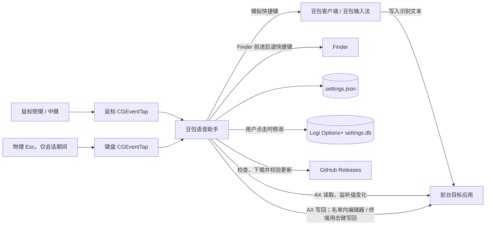
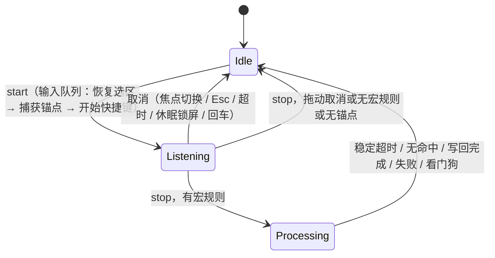

# 豆包语音助手：架构说明

## 0. 文档说明

- **基线版本**：v0.2.0 发布候选，基于 `6c6ed7a` 加上安全与稳定性修复、会话协调拆分、Swift 6 迁移和终端语音宏。
- **定位**：本文描述代码的**实际架构**。设计原则见第 2 节；尚未解决或需要实测数据的事项集中在第 19 节。
- **标记约定**：【待定】表示尚未定论、需要决策或实测数据的设计问题。

## 1. 产品边界

豆包语音助手是 macOS 菜单栏常驻的本地增强层：

- **豆包负责**：录音、语音识别、把识别结果写入当前焦点控件。
- **本 App 负责**：把鼠标按键翻译成豆包快捷键、编排一次听写会话、在听写结束后对本次新增文本执行语音宏替换。
- **本 App 不做**：录音、访问麦克风、调用任何语音或 AI 服务、与豆包进程通信。

本 App 只能维护“预期的豆包状态”。豆包是否真的开始或停止录音，本 App 无法观测。

## 2. 设计原则

| 原则 | 含义 | 落实方式 |
|---|---|---|
| 增强而非替代 | 只控制豆包并后处理其输出 | 无音频、无识别能力 |
| 本地优先 | 设置与规则仅存于本机 | 仅更新检查访问 GitHub |
| 可证明才替换 | 无法证明本次新增文本范围时保留原文 | §10.3 差分分级、§10.4 写回前后校验 |
| 破坏性操作需显式授权 | 模拟退格只在用户名单内的应用、且位置已证明时执行 | §10.4 击键写回、§10.5 终端写回 |
| 最小监听 | 只拦截已绑定的鼠标键 | 键盘监听仅在会话期间开启，只识别 Esc（§7.1） |
| 日志不含内容 | 不记录听写文本与替换结果 | §17 |
| 失败可恢复 | 异常回到空闲，不遗留按下的模拟按键 | 超时、看门狗、退出时同步释放按键 |
| 更新可验证 | 只安装与当前签名身份一致的更新 | §16 |

## 3. 技术栈

| 领域 | 选择 | 说明 |
|---|---|---|
| 构建 | Swift Package Manager（tools 6.0） | `scripts/build_app.sh` 组装并签名 `.app`；需要 Xcode 16+ |
| 语言模式 | Swift 6（完整并发检查） | 零警告；跨线程类型要么值类型 `Sendable`，要么 `@unchecked Sendable` 且由锁保护 |
| UI | SwiftUI（`MenuBarExtra`、`Form`）+ AppKit（`NSWindow`、`NSPanel`） | |
| 全局输入 | `CGEventTap` ×2（鼠标常驻、键盘按需） | 专用线程运行 RunLoop |
| 模拟按键 | `CGEvent`，`hidSystemState` 事件源，投递到 `.cghidEventTap` | 统一经由串行输入队列 |
| 文本读写 | Accessibility `AXUIElement` + `AXObserver` | 后台队列同步调用 |
| 输入法 | Text Input Sources（`TISSelectInputSource`） | 仅击键写回期间临时切换 |
| 持久化 | Codable JSON，Application Support | |
| 日志 | `os.Logger` | 只记录元数据 |
| 更新校验 | Security 框架（`SecStaticCodeCheckValidity`） | |
| 第三方依赖 | 无；Logi 修补使用系统 `SQLite3` | |
| 平台 | macOS 14+ | |

## 4. 系统上下文



## 5. 代码结构

```text
Sources/
├── DoubaoVoiceHelperCore/            # 可单测的库，不依赖 SwiftUI
│   ├── Models.swift                  # KeyboardShortcut、MouseBinding、MacroRule、AppSettings（含迁移）
│   ├── MacroEngine.swift             # 语音宏纯函数引擎
│   ├── SessionPolicy.swift           # 会话触发策略、文本稳定等待策略（纯函数）
│   ├── TextInsertionDiff.swift       # 可编辑控件的锚点差分（纯函数）
│   ├── TerminalInsertionDiff.swift   # 终端整屏缓冲的差分（纯函数）
│   ├── TextTargets.swift             # AXTextAdapter：锚点、稳定检测、写回；击键输入与输入法切换
│   ├── ShortcutStroke.swift          # 快捷键 → 按键事件序列与 flag 位（纯函数）
│   ├── SystemServices.swift          # PermissionService、CoreGraphicsShortcutEmitter、LoginItemService
│   ├── SelectionRestore.swift        # 按住式听写的选区恢复
│   ├── HoldPolicy.swift              # 长按阈值、拖动取消、AX 命中探测、微信输入区、排除匹配
│   ├── SettingsRepository.swift      # settings.json 读写与损坏备份
│   └── LogiOptionsPatcher.swift      # Logi Options+ 侧键修补
└── DoubaoVoiceHelper/                # App 目标
    ├── App.swift                     # @main、MenuBarExtra、按需弹出设置窗口
    ├── AppModel.swift                # 界面状态、设置编辑、权限、首启引导、按键捕获
    ├── DictationCoordinator.swift    # 听写会话：触发决策、豆包快捷键、锚点、语音宏写回
    ├── Diagnostics.swift             # 只含元数据的统一日志
    ├── MouseEventMonitor.swift       # 事件监听、按住判定、点击回放、Finder 导航
    ├── Views.swift                   # 菜单栏菜单、设置表单、快捷键录制器、宏预览、应用名单
    ├── OnboardingView.swift          # 首启引导
    ├── SettingsWindowController.swift
    ├── OverlayController.swift       # 屏幕浮层
    ├── UpdateService.swift           # GitHub 更新下载与安装
    └── UpdateVerifier.swift          # 更新包签名、标识与版本校验
Tests/DoubaoVoiceHelperCoreTests/main.swift   # 自定义可执行测试运行器
archive/                              # 早期原型代码与原始图标素材，不参与构建
```

### 5.1 AppModel 与 DictationCoordinator

- `AppModel`（`@MainActor`）是 SwiftUI 的数据源：设置、权限、引导、按键捕获、`AppStatus`、浮层与提示。它把鼠标事件中的 Esc 和触发事件交给协调器，其余自己处理。
- `DictationCoordinator`（`@MainActor`）独占“同一时刻至多一个”的听写会话，持有输入队列、快捷键发送器、文本适配器与选区恢复器。它通过 `DictationCoordinatorDelegate` 向 `AppModel` 读取 `DictationConfiguration`（设置快照 + 是否暂停），并回报阶段变化（idle / listening / processing）、浮层消息与失败提示。
- `AppModel` 根据阶段设置 `AppStatus`，并同步事件监听配置（会话期间开启 Esc 监听）。

## 6. 线程模型

| 执行上下文 | 负责内容 |
|---|---|
| 主线程（`@MainActor`） | `AppModel`、`DictationCoordinator` 的状态与决策、浮层、设置保存 |
| 事件监听线程 `…mouse-events` | 两个 `CGEventTap` 的回调：判断角色与排除，决定吞掉或透传 |
| `…hold-probe` 串行队列 | 按住判定时的选区快照与 AX 命中测试 |
| `…input` 串行队列 | **全部**豆包快捷键、回车、取消按键；开始快捷键之前的锚点捕获；结束时的选区恢复 |
| 全局 `userInteractive` 队列 | 长按阈值定时器 |
| 全局 `userInitiated` 队列 | 文本稳定等待、宏替换写回、Logi 修补 |
| `…navigation` 串行队列 | Finder 前进/后退快捷键 |

输入队列保证同一会话的“恢复选区 → 捕获锚点 → 开始快捷键 → 停止快捷键 / 取消按键”严格按序执行，主线程不因按键时序（每次 75–95 ms）阻塞。退出时取消会话会同步等待该队列，确保不遗留按下的修饰键。

跨线程共享的引用类型：`MouseEventMonitor`、`ActiveSession`（输入状态部分）、`CancellationToken`、`AXTextAdapter`、`AXSelectionRestorer` 均为 `@unchecked Sendable`，可变状态由锁保护；交给事件监听线程的 CF 对象在线程启动前一次性打包传入。主线程回调统一使用 `MainActor.assumeIsolated`。

## 7. 输入事件处理

### 7.1 事件监听

- **鼠标监听**：订阅 `otherMouseDown/Up/Dragged`，常驻启用。
- **键盘监听**：独立的事件监听，只订阅 `keyDown`，**仅在会话进行中启用**；只识别 Esc 且始终透传。创建失败不影响其他功能。
- 本 App 合成的鼠标事件带有标记 `0x4442484C5054`，回调直接透传。
- 收到 `tapDisabledByTimeout` / `tapDisabledByUserInput` 时按当前配置重新启用对应监听。
- 前台应用由 `didActivateApplicationNotification` 缓存，回调中不再查询 `NSWorkspace`。

### 7.2 角色分派

- 只处理 `button > 1` 的按键；左键、右键不被观察，设置层也拒绝绑定。
- 角色优先级：按住式 > 切换式 > 回车。未绑定按键上报 `.unbound`（仅诊断）后透传。
- 捕获模式下一次额外键按下上报 `.capture`，用于设置页绑定和首启确认。
- 暂停或首启未完成时全部透传。
- 已绑定的额外键在非排除应用中被吞掉，不会触发浏览器前进/后退。

### 7.3 排除应用

- `excludedBundleIDs` 作用于切换式和回车，`holdExcludedBundleIDs` 作用于按住式。匹配规则为完全相等或以 `<id>.` 为前缀。
- 默认排除常见浏览器、Finder、Preview、Orca、Ego 以及本 App 自身。
- Finder 中的侧键被吞掉，改为合成 `⌘[` / `⌘]`。

### 7.4 按住式判定

1. 按下：吞掉按下事件，记录位置与前台应用；探测队列依次做选区快照和 AX 命中测试。
2. 命中控件或祖先属于按钮、链接、滚动条、表格、窗口、工具栏等 role 时否决；微信只在输入区内允许。
3. 按住超过 0.28 s 且未被否决即开始会话。探测尚未返回不阻止开始，避免 AX 缓慢的应用拖慢听写。
4. 阈值之前移动超过 10 pt 视为拖拽，放弃本次长按。
5. 短按松开：在松开位置回放一次该按键的按下+松开。
6. 长按期间拖动达到 70 pt 进入“取消待命”，回落到 45 pt 内解除；松开时若处于待命状态，停止豆包但不做语音宏。

## 8. 豆包控制

### 8.1 快捷键模型

`KeyboardShortcut` 包含 `keyCode`、修饰键集合和可选的 `physicalKeyCodes`（区分左右修饰键）。默认值：

| 动作 | 默认鼠标键 | 默认快捷键 |
|---|---|---|
| 切换式 | 前进键（button 4） | 左 Control |
| 按住式 | 未绑定（-1） | 左 Control + 左 Option |
| 回车 | 后退键（button 3） | Return |

### 8.2 发送方式

`ShortcutStroke` 展开事件序列：按下时逐个累加修饰键，松开时逆序释放，事件带通用 flag 与左右 device flag，修饰键事件类型为 `flagsChanged`。`CoreGraphicsShortcutEmitter` 事件间隔 20 ms，`tap` 的按住时长 35 ms。所有发送都在输入队列执行。

### 8.3 与会话的对应

| 场景 | 发送内容 |
|---|---|
| 切换式开始 / 结束 | 各一次 `tap` |
| 按住式开始 / 结束 | `keyDown` / `keyUp` |
| 取消切换式会话 | Esc（仅当开始快捷键已发出） |
| 取消按住式会话 | `keyUp`（仅当开始快捷键已发出） |
| 回车 | 若有会话先取消，输入队列中等待 60 ms 让豆包提交文本，再 `tap` Return |

## 9. 会话协调

### 9.1 触发策略

`SessionTriggerPolicy.decide(role:kind:active:context:)` 是纯函数，输入为触发角色、按下/松开、当前会话（角色、阶段、已持续时间）和上下文（暂停、首启完成、冷却中），输出以下动作之一：

| 动作 | 场景 |
|---|---|
| `start` | 无会话时的切换式按下 / 按住式长按 |
| `stop` | 切换式再次按下（超过 0.15 s 防抖）/ 按住式松开 |
| `restart` | 任一会话处于 `processing` 时再按切换式：丢弃上一段的宏处理，立即开始 |
| `preemptAndStart` | 切换式会话中触发按住式：先让豆包中止，再开始按住式 |
| `ignore(原因)` | 暂停、首启未完成、冷却、防抖、另一会话占用、无会话 |

按住式结束后有 0.35 s 冷却；切换式会话 60 s 未结束自动取消。

### 9.2 状态



`processing` 阶段的看门狗为“稳定等待超时 + 2 s”。

### 9.3 焦点切换

监听 `didActivateApplicationNotification`：激活豆包或本 App 时忽略；会话发起时前台就是豆包，则把会话目标改为新激活的应用；其他任何变化都发送 Esc 取消会话。

### 9.4 选区恢复（按住式）

按下时在探测队列读取焦点控件的非空选区（30 ms 超时）。开始和结束听写前各恢复一次，使识别结果替换用户选中的文字。微信不做选区捕获。

## 10. 文本会话与语音宏写回

### 10.1 目标模式

会话结束时按目标应用选择模式：

| 模式 | 适用 | 差分 | 写回 |
|---|---|---|---|
| `standard` | 可编辑文本控件（默认） | `TextInsertionDiff` | AX 写回；名单内编辑器可击键写回 |
| `terminal` | `terminalMacroBundleIDs` 名单内的终端 | `TerminalInsertionDiff` | 只用击键写回 |

默认终端名单：Terminal、iTerm2、Ghostty、WezTerm、kitty、Warp。没有开放 AX 文本的终端会在锚点捕获阶段失败，自动退回只触发。

### 10.2 锚点与稳定检测

- 存在启用的宏规则时，在输入队列中于**开始快捷键之前**同步捕获锚点，AX 消息超时 0.1 s，耗时写入诊断日志。焦点元素解析顺序：会话目标 PID → 其焦点窗口 → 前台应用 → 系统级焦点。快照包含值、选区（同时记录应用是否真的报告了选区）、PID、bundle ID、role、窗口 hash。捕获失败时浮层提示“宏替换不可用”，会话照常进行。
- 稳定检测对锚点元素注册 `AXObserver`（`kAXValueChangedNotification`），值变化立即唤醒等待循环；不发通知的应用退化为轮询（未变化 30 ms，变化后 50 ms）。每次唤醒都校验焦点元素和身份未变。
- 值与锚点不同，且持续 **300 ms** 未再变化，视为 Settled Text。总超时 `min(1.5 s + 0.1 × 录音秒数, 4 s)`。
- 返回首次变化时间、稳定时间与通知次数，用于实测调参（§17）。

### 10.3 新增文本推断

**可编辑控件**（`TextInsertionDiff.compute`，UTF-16 偏移）：

| 级别 | 条件 | 允许的写回 |
|---|---|---|
| `exact` | 锚点选区前后的文本都未变 | AX 写回；名单内编辑器可击键写回 |
| `appended` | 文本只在末尾增长 | 仅 AX 写回 |
| `commonPrefix` | 只能确定公共前缀，之后全部视为新增 | 仅 AX 写回 |

公共前缀按字面 UTF-16 比较，并回退到完整字符边界。

**终端**（`TerminalInsertionDiff.compute`，结果级别 `terminalLine`）：

1. 求原文与现文的最长公共前缀和（不重叠的）最长公共后缀，中间分别为“被移除部分”和“新增部分”。
2. 被移除部分只能是空白填充（空格、制表符、不换行空格）；否则说明屏幕别处有变化（命令输出、时钟、占位提示），拒绝。
3. 新增部分不能含换行（长句自动换行、多行输出都拒绝）。
4. 若终端报告了光标且光标落在新增部分内，光标之后只能是空白，插入文本截止到光标；否则，若消耗了填充空白（TUI 输入框），去掉新增部分末尾的空白；纯插入（shell 提示符）则保留全部新增内容。

### 10.4 可编辑控件的写回

写回前再次校验焦点、身份和全文未变，然后：

1. 选中新增范围并写 `kAXSelectedText`；失败则写整段 `kAXValue` 并把光标放到替换文本之后。
2. 300 ms 内读回：等于预期即成功；仍等于写回前的文本表示写入被忽略，进入第 3 步；变成其他内容则立即放弃。
3. **击键写回**，同时满足才执行：应用在 `keystrokeFallbackBundleIDs` 名单中（默认 Orca、Cursor、VS Code）；差分级别为 `exact`；新增文本不含多标量字符；当前选区恰好等于新增范围（直接输入），或光标恰好位于新增文本末尾（先按字符数退格）。完成后 400 ms 内读回校验。

### 10.5 终端写回

终端缓冲只读，直接走击键：

1. 校验焦点、身份和整屏文本自稳定以来未变；新增文本不含多标量字符。
2. 在光标处按字符数退格，再输入替换结果。
3. 校验：600 ms 内，整屏文本必须以“插入点之前的原内容 + 替换结果”开头。插入点之后的内容不参与比较，因为 TUI 可能在输入 `/` 后弹出命令菜单。

两种击键写回都会临时切换到 ASCII 键盘布局（避免中文输入法把模拟按键转成拼音），替换文本按每个事件 ≤ 20 个 UTF-16 单元分段输入，完成后恢复原输入法。校验失败时浮层提示用户检查文本。

### 10.6 降级路径

以下情况只触发豆包、保留原文：没有启用的宏规则、锚点捕获失败、焦点变化、稳定超时、差分被拒绝、宏无命中、写入被忽略且应用不在名单中、写回被其他修改干扰、会话被取消。写入被忽略或校验失败时，浮层给出非阻塞提示。

## 11. 语音宏引擎

`MacroEngine.apply` 是纯函数：

1. 过滤禁用规则；每条规则的来源文本按 `|` 拆成多个别名。
2. 输入与别名都去掉可忽略字符（中英文逗号、顿号、句号、叹号、问号、分号、冒号，以及空白）后比较，大小写敏感。
3. 按别名字符数降序，同长度保持规则顺序；从左到右扫描，同一位置取第一条匹配，替换结果不再参与匹配。
4. 匹配区间内的可忽略字符随匹配一起被替换；区间外原样保留。
5. 若所有非可忽略字符都被匹配覆盖（整句都是命令），输出只由替换结果拼接而成，结尾标点一并去掉。

`validate` 报告空来源和（归一化后）重复的别名，设置界面逐条提示；设置页提供实时预览。默认规则：`斜杠批准` → `/approve`，`斜杠任务` → `/missions`，`斜杠` → `/`。

## 12. 设置与持久化

- 路径：`~/Library/Application Support/DoubaoVoiceHelper/settings.json`，原子写入。
- 当前 schema 12。解码时完成全部迁移，其中：schema 10 解绑左右键的按住式绑定；schema 11 把旧默认规则 `approve` / `Approve` → `/approve` 改为禁用（保留不删），并引入击键写回名单；schema 12 引入终端名单。旧字段 `wechatHoldPreemptEnabled` 被忽略。
- 解码失败时备份为 `settings.corrupt-<时间戳>.json` 并使用默认值。
- 宏规则文本编辑防抖 0.6 s 后保存，其余修改立即保存；退出和安装更新前会写入待保存内容。
- 鼠标键冲突在修改前校验，冲突时拒绝修改并提示占用者。
- 三个应用名单（导航排除、击键写回、终端语音宏）共用同一组增删与选择应用的接口（`AppList`）。

## 13. 权限模型

- **辅助功能**：必需。用于事件监听、模拟按键和 AX 读写。首启在引导的权限步骤中请求；之后启动若未授权会弹出系统授权框。
- **输入监控**：任一动作绑定了 button ≥ 2 即视为必需（实际上启用任何功能都需要）。
- 缺少必需权限时状态为“需要权限”，事件监听不会启动。
- 不需要麦克风、屏幕录制。

## 14. 界面

- **菜单栏**：状态、暂停/恢复、打开设置、检查权限、检查更新、退出。
- **设置窗口**：只在首启未完成或缺少必需权限时自动弹出；其余情况从菜单栏打开。分区为常规、输入、罗技适配、语音宏（含校验提示与预览）、击键写回名单、终端语音宏名单、导航排除、权限、更新、说明。
- **首启引导**：介绍 → 权限 → 逐个确认默认鼠标键（超时后给出 Options+ 说明）→ 登录启动。
- **浮层**：不激活的 `NSPanel`，显示在鼠标所在屏幕底部，包括听写、取消待命、已停止、发送、提示五种样式。

## 15. 第三方集成：Logi Options+ 修补

用户点击修复后：结束 Logi 进程 → 备份 `settings.db` → 将 `_c83` / `_c86` 槽位改为原生 Button 4/5 → 写回 → 重启 Logi agent。命令行脚本 `scripts/patch_logi_buttons.py` 提供同样能力。只在用户显式操作时执行。

## 16. 构建、分发与更新

- **本地构建**：`setup_local_signing.sh` 创建自签名证书；`build_app.sh` 编译、组装并签名（非临时签名时启用 Hardened Runtime，Developer ID 身份额外加时间戳），最后 `codesign --verify --strict`；`build_dmg.sh` 生成 DMG。
- **CI 发布**（`macos-15` runner）：推送 `v*` 标签后写入 `CFBundleShortVersionString` 与 `CFBundleVersion`（运行编号）→ 测试 → 导入自签名证书 → 可选导入 Developer ID 证书 → 构建 → 可选公证并装订 app 与 DMG → 发布 zip 和 DMG。Developer ID 与公证只在配置了对应 secrets 时执行。
- **应用内更新**：下载 zip → 解压 → `UpdateVerifier` 校验（bundle ID 一致、版本更高、签名满足当前应用的 designated requirement；当前为临时签名时拒绝）→ 启动替换脚本（路径以参数传入）：先复制为 `.updating`，成功后替换旧应用并移除隔离属性，再重新打开。
- 从自签名切换到 Developer ID 会改变 designated requirement，现有用户需手动安装一次。

## 17. 诊断与日志

`Diagnostics` 通过 `os.Logger` 记录稳定事件名，字段只含 bundle ID、按键号、长度、计数、耗时和错误枚举，**不含听写原文或替换结果**。

主要事件：`mouse_event_tap_started`、`mouse_button_received`、`session_ignored`、`session_preempted_by_hold`、`anchor_captured`（含耗时）、`anchor_failed`、`mouse_session_started`、`shortcut_emitted`、`text_settled`（模式、差分级别、长度、录音时长、首次变化、稳定耗时、通知次数）、`macro_result`（命中数、输入输出长度）、`replace_success`（写回方式）、`macro_not_applied`（原因）、`macro_skipped`、`focus_changed`、`session_timeout`、`enter_emitted`。

查看：`log stream --predicate 'subsystem == "com.jarod.doubao-voice-helper"'`。

## 18. 测试

- `swift run DoubaoVoiceHelperCoreTests`，当前 51 个用例。
- **已覆盖**：宏引擎（最长匹配、非递归、Unicode、禁用、标点忽略、别名、整句命令、默认规则不改写英文、校验）、可编辑控件差分（中间插入、选区替换、UTF-16 偏移、末尾追加、公共前缀、无新增）、终端差分（shell 提示符、TUI 填充、拒绝命令输出 / 换行 / 占位提示 / 别处变化、光标决定末尾空白、UTF-16 位置）、击键分段、会话触发策略、稳定等待策略、快捷键事件序列、schema 迁移（含 schema 11、12）、设置读写与损坏备份、微信区域、拖动取消、选区恢复策略、按住否决、排除列表、Logi JSON 修补。
- **未覆盖（需真机）**：AX 读写与 `AXObserver`、各终端的 AX 缓冲格式、输入法切换、事件监听、签名校验、`DictationCoordinator` 与 `AppModel` 的集成行为。

## 19. 待定事项

| # | 事项 | 说明 |
|---|---|---|
| 1 | 稳定参数实测 | 300 ms 静默期与超时公式需要用 `text_settled` 日志在豆包客户端和输入法上实测后调整 |
| 2 | 击键写回真机验证 | 编辑器名单与终端名单内各应用的 AX 表现、输入法切换需逐个验证；终端需确认 AX 值是否包含滚动缓冲、宽字符与换行的表示方式 |
| 3 | 公开分发 | 需要 Apple Developer 账号；CI 已支持 Developer ID 签名与公证 |
| 4 | 兼容性展示 | 是否在设置页按应用展示“支持 / 仅触发 / 击键写回 / 终端” |
| 5 | 豆包状态感知 | 未检测豆包是否在运行；豆包识别仍含 `contains("doubao")` 子串匹配 |
| 6 | 协调器可测性 | `DictationCoordinator` 仍直接依赖 `AXTextAdapter` 与定时器，尚无集成测试；可抽象文本适配器与时钟后补测 |
