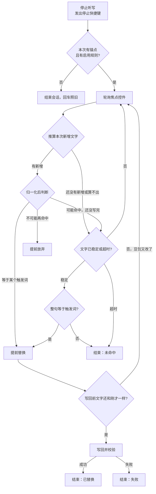

# 语音宏重新设计：设计文档

- 状态：已确认设计，待实现
- 日期：2026-09-24
- 基线：v0.2.0（f73d677）
- 相关决定：[ADR 0002 整句触发与提前替换](../adr/0002-whole-utterance-macros-with-early-replace.md)、[ADR 0003 回车等语音宏完成](../adr/0003-enter-waits-for-macro.md)
- 术语以仓库根目录的 `CONTEXT.md` 为准。
- 实施步骤见 [implementation.md](./implementation.md)。

## 1. 背景与目标

语音宏（Macro Rule）让用户说一个短词，例如 “usage”，自动变成 “/usage”。用户把语音触发分成三类：常用文本、敏感信息、动作。本次只做第一类“常用文本”，目标是：

1. **真正能用**：在用户常用的应用里稳定生效。
2. **更稳**：不误替换、不丢替换，失败时不产生副作用。
3. **更快**：从停止听写到替换完成，常见情况不超过 0.8 秒，最慢不超过 1.5 秒。

## 2. 现状与数据

### 2.1 真实日志（2026-09-24 上午约 3 小时，v0.2.0，120 次听写）

| 应用 | 听写次数 | 结果 |
|---|---|---|
| 微信 | 93（78%） | 93 次全部在开始时读不到焦点输入框（`noFocusedElement`），语音宏从未运行 |
| Orca（终端模式） | 18 | 6 次命中规则。5 次在确认途中被回车取消，没有任何记录；1 次记为“校验失败” |
| Notion | 8 | 文字都读到了，但 0 次命中规则 |
| Cursor | 1 | 无法确定新增文字（`insertionNotUnique`） |

耗时（毫秒）：

| 阶段 | 中位数 | p90 |
|---|---|---|
| 停止 → 文字稳定 | 642 | 816 |
| 停止 → 首次写入（`first_change_ms`） | 2 | 262 |
| 停止 → 用户按回车（微信 / Orca / Notion） | 1216 / 1501 / 1224 | |
| 终端写回 + 校验（仅 1 个样本） | 885 | |

约 60% 的会话里，豆包会在停止后 0.3 到 0.55 秒再改一次文字（多半是补标点），于是“静默 0.3 秒”要再等一轮。

### 2.2 根因

1. **终端校验误报。** 用户确认在 Orca 和 Ghostty 里替换实际成功了，但程序的读回校验判定失败。按回车时正好在校验中，就被取消且没有日志。这说明校验逻辑本身有问题，原因待查（见第 9.2 节）。
2. **回车会打断语音宏。** `sendEnter` 先 `cancel()` 再发回车（`DictationCoordinator.swift:231-254`）。用户按回车的时间（约 1.1 到 1.5 秒）比终端完成替换的时间更早。
3. **微信读不到输入框。** 原因未知，见第 9.1 节。
4. **Notion 没命中。** 文字读取正常，问题在识别结果和触发词对不上。程序不记文字，无法判断具体偏差。
5. **匹配太严。** 区分大小写（用户因此把 18 条规则中的多数写了大小写两份），不统一全角半角，引号、括号等字符会打断匹配。
6. **固定等待。** 无论是否可能命中，都要等“静默 0.3 秒”，而且豆包补标点会让等待翻倍。

## 3. 范围

**本次做：**

- 整句触发的匹配规则，忽略标点、空格、大小写与全角半角。
- 提前放弃（Early Reject）与提前替换（Early Replace）。
- 回车等待语音宏，替换失败时不发送回车。
- 修复终端校验误报。
- 微信能否支持的验证，限时 1 到 2 小时。
- 最近识别（Recent Dictations）与“添加为别名”。
- 诊断改进：每次会话一个编号，本地会话记录保留 30 天。
- schema 13：合并只差大小写的重复规则；同时修复 schema 升级重复追加默认排除应用的 bug。

**本次不做**（见第 12 节“以后再做”）：敏感信息、钥匙串、快速插入选择器、光标处插入、动作与 AI、输入法档案（候选 1）。

## 4. 匹配规则

### 4.1 整句触发

- 判断对象是**本次听写的 Inserted Text**，不是整个输入框。输入框里已有 “git ”，再说 “usage”，新增的文字是 “usage”，照样替换成 “/usage”，前面的 “git ” 不动。
- Inserted Text 归一化后，**整句等于**某条规则的某个触发词（含 `|` 分隔的别名），才替换。
- 替换时，整段 Inserted Text（包括豆包加的标点和空格）都换成目标文本。例如 “Usage。” 变成 “/usage”。
- 不做句中替换，不保留后文。需要接后文时，用户分两次听写。

### 4.2 归一化

对 Inserted Text 和触发词做同一套归一化，然后比较：

1. Unicode NFKC 规范化：全角字母、数字统一成半角，例如 “ｕｓａｇｅ” 变成 “usage”。
2. 转成小写。只影响有大小写的字母，中文不受影响。
3. 删除以下字符：
   - 所有 Unicode 标点（类别 P*），包括中英文句号、逗号、引号、括号、破折号、省略号；
   - 所有空白和分隔符（类别 Z*，以及制表符、换行）；
   - 格式字符（类别 Cf），例如零宽空格。
4. 符号类字符（类别 S*，例如 `+`、`$`、`~`）保留。

触发词归一化后为空，属于无效规则（沿用 `emptySource` 校验）。

> 说明：`/` 属于标点，会被删除。触发词是说出来的话，不会含 `/`；目标文本不做归一化，原样写入。

### 4.3 规则校验

| 问题 | 条件 | 级别 |
|---|---|---|
| 触发词为空 | 归一化后为空 | 错误，规则不生效 |
| 触发词重复 | 两条启用的规则有归一化后相同的触发词 | 错误，保留先出现的那条 |
| 触发词互为开头 | 一个触发词归一化后是另一个的开头，例如 “model” 与 “models” | 提醒，规则照常生效 |

触发词互为开头时，提前替换可能在豆包写完之前就按较短的触发词替换。按用户决定不做特殊处理，只在设置里提醒。

### 4.4 目标文本里的空格

- 目标文本原样写入，不自动加空格。需要和下一次听写隔开时，用户自己在目标文本末尾加空格，例如 “/model ”。
- 设置界面把目标文本开头和末尾的空格显示为 “␣”，方便看出来。

## 5. 会话流程

### 5.1 总览

### 5.2 每次轮询的判断

每次读到焦点控件的新内容，就用现有的差分方法（标准模式用 `TextInsertionDiff`，终端模式用 `TerminalInsertionDiff`）推算本次新增文字，然后做一次纯函数判断：

| 判断结果 | 条件 | 动作 |
|---|---|---|
| 等待 | 还没有新增文字；差分失败（豆包可能正在改字）；或归一化后的文字是某个触发词的开头但还不相等 | 继续轮询 |
| 命中 | 归一化后等于某个触发词 | 提前替换 |
| 放弃 | 归一化后的文字不是任何触发词的开头 | 提前放弃 |

- 归一化后为空（例如豆包只写了一个标点），按“等待”处理。
- 差分失败时不立即判失败，继续等，直到文字稳定或超时，再用最终文字判断。这样豆包中途改字时不会误判。
- 文字已稳定（静默 0.3 秒）或超时时，按最终文字判断：命中就替换，否则结束。超时和现在一样由 `SettlePolicy` 决定。

### 5.3 提前替换

- 命中后立即写回，不再等文字稳定，也不在写回后观察豆包的后续改动（ADR 0002）。
- 写回前沿用现有检查：焦点没变，控件内容和判断时读到的一样。如果内容变了（豆包又改了字），**不判失败**，回到轮询继续判断，直到超时。
- 写回方式沿用现有的 `replace`：先用辅助功能写入，不生效时对名单内的应用用模拟键入；终端用退格加键入。
- **校验放宽：** 替换结果后面紧跟标点，也算成功。标准模式下，只要控件内容等于“替换前的前文 + 目标文本 + 若干个被归一化删除的字符 + 原来的后文”，就判为成功。终端模式原本就只比较前缀，不受影响。
- 替换成功后，浮窗显示“已应用语音宏”，是否显示遵循浮窗开关。

### 5.4 提前放弃

- 放弃后，立即结束本次会话的“正在处理”状态，回车不再等待。
- 为了支持最近识别，放弃后在后台继续读取最多 1 秒，拿到最终文字（见第 7 节）。后台读取只读、不写入，焦点变化就停止，不影响下一次听写。

## 6. 回车

按用户决定和 ADR 0003：

| 按回车时的状态 | 行为 |
|---|---|
| 没有会话 | 照旧，直接发送 |
| 听写中，本次会话**不能**跑语音宏（没有锚点或没有启用规则） | 照旧：结束会话，等 60 毫秒后发送 |
| 听写中，本次会话**能**跑语音宏 | 先停止听写，进入语音宏处理，按下一行处理 |
| 正在处理语音宏 | 记下“待发送”，等语音宏得出结果：已替换、未命中、提前放弃，都发送回车；替换失败，不发送 |
| 等待超过 2 秒 | 如果还没开始写回，取消语音宏并发送回车，原文不动；如果已经开始写回，等写回结果再按上一行处理 |

- 取消（Esc、暂停、睡眠、切换应用）的行为不变，待发送的回车随会话一起丢弃。
- 替换失败时是否提示，完全遵循浮窗开关。浮窗关闭时不提示，这是用户接受的取舍。
- 发送回车前仍保留现有的 60 毫秒间隔，给豆包提交文字留时间。

## 7. 最近识别

**用途：** 看到豆包实际写了什么，发现识别偏差（例如 Notion 里没命中），一键补上别名。

- 记录最近 **5** 条、每条不超过 **20** 个字符的 Inserted Text，以及应用名称、时间、是否命中。
- 只存在内存里，退出应用即清空。不写磁盘，不进日志，不进会话记录。
- 数据来源：
  - 命中或未命中的会话：用判断时的最终文字。
  - 提前放弃的会话：后台继续读取最多 1 秒，拿到最终文字；超过 20 个字符就不记录。
- 界面放在设置的语音宏页面，每条旁边有“添加为别名…”按钮：选一条现有规则，把这段文字作为别名加进去；也可以选择新建规则。添加时去掉末尾标点。

## 8. 诊断

### 8.1 统一日志

- 每次会话生成一个短编号，写进这次会话的每一条事件。
- 新增事件：`macro_cancelled`（取消时处在哪一步）、`macro_early_reject`、`macro_early_replace`、`enter_deferred`、`enter_withheld`。
- 仍然只记元数据：应用 bundle ID、长度、次数、耗时、方法、错误名，不记文字。
- 错误写入日志时，只写错误的枚举名，不写 `"\(error)"`，防止以后错误里带上文字。

### 8.2 本地会话记录

- 路径：`~/Library/Logs/DoubaoVoiceHelper/sessions.jsonl`，每行一次会话。
- 保留 30 天，启动时删除更早的记录。
- 每条记录的字段：

| 字段 | 含义 |
|---|---|
| `id` | 会话编号 |
| `startedAt` | 开始时间（ISO 8601） |
| `app` | 目标应用 bundle ID |
| `mode` | `standard` / `terminal` |
| `role` | `toggle` / `hold` |
| `listenedMs` | 听写时长 |
| `anchor` | `captured` 或失败原因 |
| `outcome` | `replaced` / `noMatch` / `earlyRejected` / `skippedNoAnchor` / `cancelled` / `failed` / `timeout` |
| `decision` | `early` / `settled` / `none` |
| `failure` | 失败原因枚举名（如有） |
| `method` | `accessibility` / `keystrokes`（如有） |
| `firstChangeMs` | 停止 → 首次写入 |
| `decisionMs` | 停止 → 得出命中或放弃的结论 |
| `doneMs` | 停止 → 语音宏结束（含写回校验） |
| `enter` | `none` / `sent` / `withheld`，以及等待时长 `enterWaitMs` |

- 不记任何文字，也不记文字长度以外能推出内容的信息。

## 9. 应用兼容

### 9.1 微信（限时验证）

- 目标：查清为什么读不到焦点输入框。
- 可能的原因：微信不提供辅助功能树；需要设置 `AXManualAccessibility` 或 `AXEnhancedUserInterface` 这类开关；我们找焦点的顺序对它无效。
- 限时 1 到 2 小时。结论分两种：
  - **能读到**：纳入本次，按普通应用处理，必要时在找焦点时加上对应的开关。
  - **读不到**：微信保持“只控制启停”（Trigger Only），在设置的语音宏页面标注“微信不支持语音宏”。
- 不采用模拟全选加复制读取剪贴板的方案。

### 9.2 终端校验误报（限时修复）

- 目标：查清 Orca 和 Ghostty 里替换成功、却被判为失败的原因，并修正校验。
- 现有校验（`TextTargets.swift:399-424`）：键入后反复读取，要求内容“不等于键入前，并且以‘前文 + 目标文本’开头”，最多等 0.6 秒。
- 待验证的假设：
  1. Orca 暴露的是 xterm.js 的隐藏输入框（锚点角色为 `AXTextField`、长度 0），输入后会被清空，永远不会出现“前文 + 目标文本”。
  2. Claude Code、Codex 等 TUI 在键入 “/” 后会重绘输入框前面的内容，例如状态行，前缀因此变了。
  3. 0.6 秒不够，重绘完成得更晚。
- 限时半天。查不清原因的终端，改为“键入完成即算成功”，只对这些终端生效，名单写在代码常量里，不做成设置项。

### 9.3 Notion 与其他应用

- Notion 的读取没有问题，靠最近识别找出识别偏差，由用户补别名。
- Cursor 的 `insertionNotUnique` 只有 1 次，本次只记录，不专门处理。

## 10. 速度预算

| 阶段 | 预计耗时 | 说明 |
|---|---|---|
| 停止快捷键 | 约 36 毫秒 | 不变 |
| 豆包首次写入 | 0 到 330 毫秒 | 不受本应用控制 |
| 判断 | 最多一个轮询间隔（30 到 50 毫秒） | 提前替换或提前放弃，不再等 0.3 秒静默 |
| 写回并校验（辅助功能） | 约 20 到 40 毫秒 | 成功即返回 |
| 写回并校验（终端） | 约 50 到 150 毫秒 | 修好校验后，第一次读取就能确认 |

- 预计常见情况在 0.2 到 0.5 秒内完成，满足 0.8 秒的目标。
- 用本地会话记录的 `doneMs` 验证：连续使用一周，中位数不超过 800 毫秒，p90 不超过 1500 毫秒。

## 11. 设置与迁移（schema 13）

1. **先修 bug：** `Models.swift:361-367` 在每次 schema 升级时，都会把用户删掉的默认导航排除应用重新加回来。改为：每个默认排除应用记下它加入时的 schema 版本，只在从更早的版本升级时才补上。
2. **合并重复规则：** 触发词归一化后相同、目标文本也相同的规则合并成一条，保留第一条的触发词写法和位置；只要其中有一条启用，合并后就是启用的。目标文本不同的，不合并，由重复校验提示。
3. `currentSchemaVersion` 升到 13。
4. 不新增设置字段。最近识别只在内存里；终端免校验名单是代码常量。

按用户现有的 18 条规则估算，合并后约剩 11 条。其中两条保存的是个人信息，本次仍作为普通规则以明文保存，敏感信息的处理见第 12 节。

## 12. 以后再做

以下内容本次不做，这里记录已经查到的事实，以免重新调研：

- **敏感信息：**
  - 在 macOS 的密码框里，系统会禁用中文输入法，豆包的语音不可用，所以“在密码框里说触发词”走不通；密码类信息需要快速插入选择器这类入口。
  - 本机应用使用固定的自签名证书签名（不是临时签名），钥匙串授权在重新构建后应该能保持；没有 Apple 开发者团队 ID，只能用传统钥匙串，不能用访问组。
  - 现有两条保存个人信息的规则，以后应迁移到敏感信息存储。
- **快速插入与光标处插入：** 见 2026-09-23 架构报告的候选 3、4。找焦点、快照、读回这些能力目前是 `AXTextAdapter` 的私有方法，光标处插入最省事的做法是在同一个类型里新增方法。
- **动作与 AI（类型 3）：** 例如说“表情包”打开微信表情面板，说“关闭”关闭窗口。它不属于 Macro Engine（语音宏是确定性的本地替换），需要单独的概念，也可能需要自己的语音识别或实时语音模型。
- **输入法档案（候选 1）：** 设计已基本定稿，等要支持第二个语音输入法时再实现。
